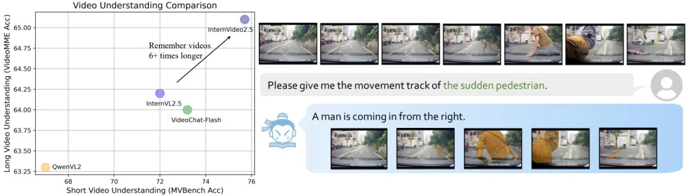

> Recently, the Shanghai AI Lab, in collaboration with Nanjing University and the Shenzhen Institutes of Advanced Technology, jointly open-sourced the multi-modal video model Shusheng InternVideo2.5.
> In the field of video understanding, the upgraded InternVideo2.5 has achieved improvements in both temporal span and fine granularity, expanding its capacity sixfold compared to the previous model. It enables a precise "needle in a haystack" search within long videos containing tens of thousands of frames, allowing AI to more accurately interpret the complex real world and infuse new quality into various applications. Previously, the Shusheng InternVideo series was applied during the live broadcast of the Paris Olympics by China Central Television, precisely pinpointing athletes' scoring moments and corresponding slow-motion replays, significantly enhancing TV production efficiency. With enhanced long video processing capabilities, InternVideo2.5 will offer more efficient AI support for applications such as autonomous driving, security surveillance, and virtual reality.

Open source link: <a href="https://github.com/OpenGVLab/InternVideo/tree/main/InternVideo2.5">https://github.com/OpenGVLab/InternVideo/tree/main/InternVideo2.5</a>
 Paper link: <a href="https://arxiv.org/abs/2501.12386">https://arxiv.org/abs/2501.12386</a>
 Huggingface link: <a href="https://huggingface.co/OpenGVLab/InternVideo2_5_Chat_8B">https://huggingface.co/OpenGVLab/InternVideo2_5_Chat_8B</a>



### Focus on Fine-Grained Spatiotemporal Understanding and Efficient Long Video Processing

Shanghai AI Lab has continuously invested in video multi-modal large model (Video MLLM) technology since 2022, successively launching and open-sourcing the general video foundation model Shusheng InternVideo, the video understanding large model Shusheng InternVideo2, and the dialogue-centric video understanding paradigm VideoChat. By leveraging its experience in video visual representation learning and multi-modal dialogue, the upgraded InternVideo2.5 focuses on fine spatiotemporal understanding through deep integration of visual perception and language comprehension, achieving breakthroughs in long video understanding.

**InternVideo2.5 Capability Characteristics:**

- Ultra-long video processing: Accurately locate targets within tens of thousands of frames, with processing length extended from 3,000 to 10,000 frames.
- Fine-grained perception: Accurately identify and locate objects, scenes, and actions while comprehending subtle spatiotemporal relationships.
- Integration of multiple visual capabilities: Not only supports general video Q&A but also proficiently handles specialized tasks such as object tracking and segmentation.

Left image: Performance comparison between InternVideo2.5 and other 8-billion-parameter open models on MVBench and VideoMME; Right image: InternVideo2.5 accurately tracks and analyzes videos.

### LRC Combined with Progressive Training to Overcome Bottlenecks in Long Video Modeling
For long videos and fine-grained visual tasks, traditional video multi-modal large models face significant challenges in accurately tracking target objects in ultra-long videos or recognizing subtle spatiotemporal relationships in complex scenes. For example, in "needle in a haystack" tasks, conventional methods require extensive computational resources and deliver unsatisfactory localization accuracy, thereby limiting industrial applications.
To address this, Shanghai AI Lab, together with its research team, leveraged its self-developed Shusheng InternVL2.5 base model to propose Long-range Context Modeling (LRC) technology as a solution.

**The Two Core Modules of Long-range Context Modeling (LRC) Technology:**

- Hierarchical Context Compression (HiCo): Exploits redundancy in long video visual data through layered compression. Experimental results demonstrate that with HiCo, InternVideo2.5 can accurately locate target frames within tens of thousands of frames, leading in performance among open models.

- Task Preference Optimization (TPO): Transforms annotations from various fine-grained visual tasks (such as object tracking, segmentation, and temporal localization) into differentiable task preferences, thereby guiding the model's self-learning to extend its capabilities to specialized visual applications.

Additionally, the team pre-trained InternVideo2.5 using a progressive multi-stage training strategy on over 300,000 hours of video data, ensuring robust video processing capabilities. The training corpus includes vision-language alignment data, long video sequences, and specialized visual task data, providing abundant information for comprehensive model learning. Following the progressive training scheme of Shusheng InternVL, the approach enhances fine-grained perception and temporal understanding in stages: initial basic learning for task recognition and video-language alignment; subsequent integration and training of specific task components alongside visual concept pre-training; and finally, multi-task training combined with instruction fine-tuning on mixed corpora to optimize all model components. This method achieves effective scaling from "small to large" and refinement of data from "coarse to fine", reducing costs while enhancing performance.

<a href="https://mp.weixin.qq.com/s/kId4bxMbbR4kT2Q_HXCpsg" target="_blank">View Original</a>