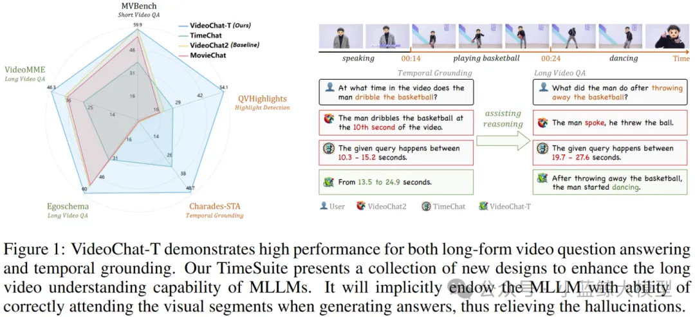
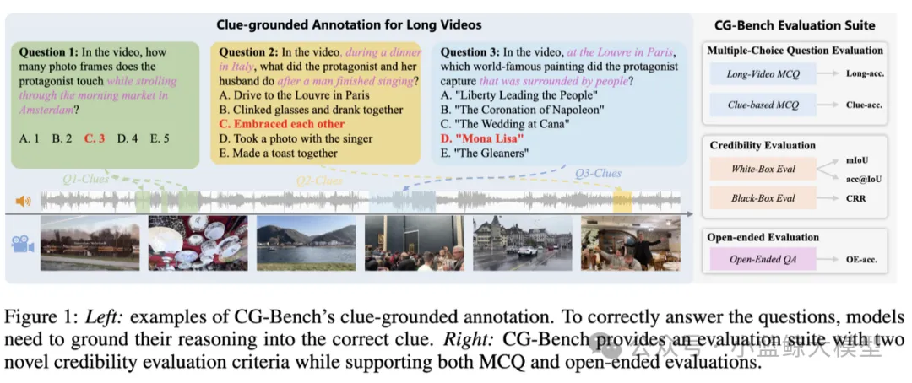
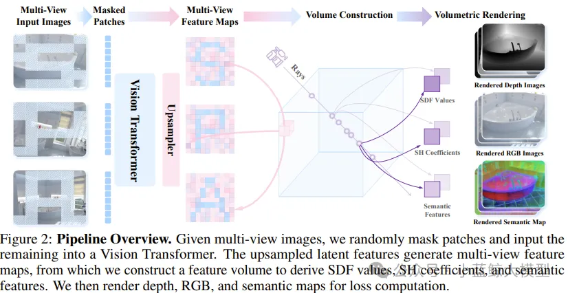
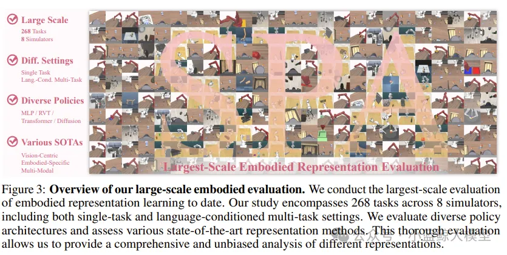
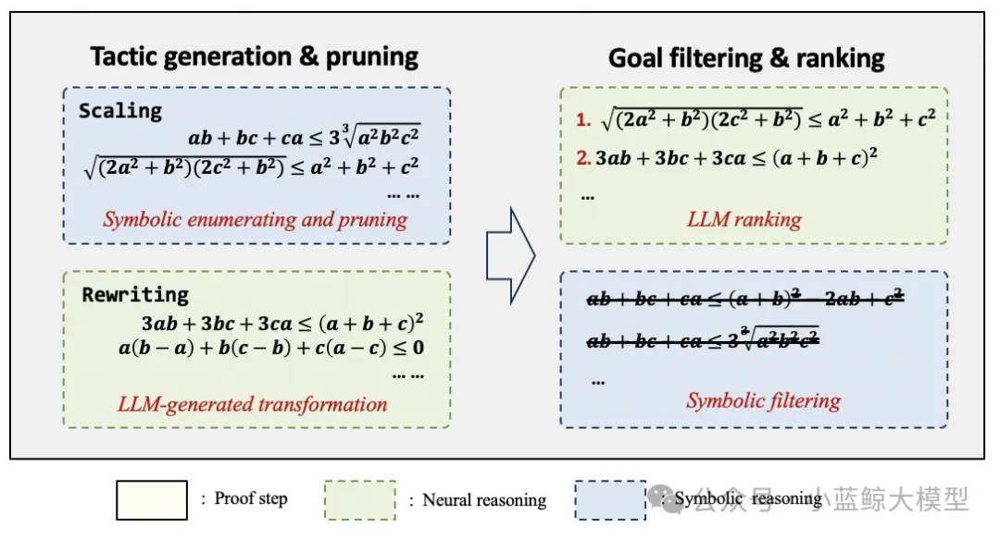

> ICLR (International Conference on Learning Representations) is one of the leading AI conferences focusing on deep learning and representation learning. Since its inception in 2013, ICLR has become a premier platform for machine learning research, particularly in deep learning, neural architectures, reinforcement learning, generative models, and NLP.
>
> Five papers from the Large Model Innovation Center of Nanjing University’s School of Computer Science were accepted at ICLR25.

# 01

**Title:** TimeSuite: Improving MLLMs for Long Video Understanding via Grounded Tuning  
**Authors:** Xiangyu Zeng, Kunchang Li, Chenting Wang, Xinhao Li, Tianxiang Jiang, Ziang Yan, Songze Li, Yansong Shi, Zhengrong Yue, Yi Wang, Yali Wang, Yu Qiao, Limin Wang  
**Affiliations:** Nanjing University, Shanghai AI Laboratory, Chinese Academy of Sciences, etc.  
**Link:** https://openreview.net/forum?id=nAVejJURqZ  
**Abstract:** Most existing video multimodal large models tend to focus on irrelevant segments when understanding long videos, often leading to hallucinations. Can we enhance MLLMs’ long-video QA performance by using temporal localization as an auxiliary task to pinpoint relevant subsegments? We propose TimeSuite, which incrementally fine-tunes short-video MLLMs with time-location data to boost long-video understanding. TimeSuite includes: a simple, efficient long-video framework (VideoChat‑T); a high‑quality localization‑based instruction tuning dataset (TimePro); and a tailored instruction task (Temporal Grounded Caption). Joint tuning guides MLLMs to focus on correct segments, improving QA accuracy. First, VideoChat‑T achieves expert‑level temporal localization without external decoders while retaining strong QA generalization and zero‑shot ability. Second, integrating the expert task enhances comprehensive long‑video understanding, validating this hybrid approach. Experiments show VideoChat‑T yields 5.6% and 6.8% accuracy gains on Egoschema and VideoMME, respectively, and demonstrates superior zero‑shot localization, matching supervised expert models after fine‑tuning.

# 02

**Title:** CG-Bench: Clue‑grounded Question Answering Benchmark for Long Video Understanding  
**Authors:** Guo Chen, Yicheng Liu, Yifei Huang, Yuping He, Baoqi Pei, Jilan Xu, Yali Wang, Tong Lu, Limin Wang  
**Affiliations:** Nanjing University, Shanghai AI Laboratory, Fudan University, Zhejiang University  
**Link:** https://openreview.net/forum?id=le4IoZZHy1  
**Abstract:** We introduce CG‑Bench, a benchmark for long‑video multimodal reasoning using a “Clue‑Question‑Answer” triplet. Unlike multiple‑choice tests, models must answer correctly and accurately locate supporting video segments. CG‑Bench offers three tasks: perception (basic visual skills), reasoning (temporal & multimodal integration), and hallucination detection (reliability under ambiguity). It uses dual evaluation: white‑box IoU for localization precision and black‑box Clue Recovery Rate for context dilution. Combining multiple‑choice and open‑ended forms with human annotations and heuristic rules, CG‑Bench ensures evaluation quality. The dataset contains 1,219 long videos across 638 subcategories, totaling 12,129 QA pairs. Results show models like GPT‑4o perform well on multiple choice but drop sharply when localization is required (white‑box acc@IoU only 4.38%, open‑ended accuracy <40%). Performance varies with video length, frame sampling, and multimodal cues, highlighting challenges in precise information retrieval for long‑video reasoning.

# 03

**Title:** SPA: 3D Spatial‑Awareness Enables Effective Embodied Representation  
**Authors:** Haoyi Zhu, Honghui Yang, Yating Wang, Jiange Yang, Limin Wang, Tong He  
**Affiliations:** University of Science and Technology of China, Shanghai AI Laboratory, Zhejiang University, Tongji University, Nanjing University  
**Link:** https://openreview.net/forum?id=6TLdqAZgzn  
**Abstract:** Spatial awareness is critical for robots in complex environments, but existing methods struggle to capture 3D geometry. We propose SPA, a visual representation framework that enhances 3D spatial awareness for embodied tasks. SPA trains on a large multi‑view dataset with camera poses, depth, and semantic maps from synthetic and real robot scenes. It builds volumetric features from multi‑view input, uses mask‑based differentiable neural rendering to generate RGB, depth, and semantic maps, and applies Eikonal regularization with SDF supervision for geometric consistency. After 6,000 GPU hours, SPA outperforms baselines on 200+ tasks across real and eight simulated environments, ranking first in 30.3% of tasks.

# 04

**Title:** Proving Olympiad Inequalities by Synergizing LLMs and Symbolic Reasoning  
**Authors:** Zenan Li, Zhaoyu Li, Wen Tang, Xian Zhang, Yuan Yao, Xujie Si, Fan Yang, Kaiyu Yang, Xiaoxing Ma  
**Affiliations:** Nanjing University, University of Toronto, Microsoft Research Asia, Peking University, Meta  
**Link:** https://openreview.net/forum?id=FiyS0ecSm0  
**Abstract:** AI has advanced in competition‑level proofs, especially inequalities, which pose huge search spaces at each step. We present a neural‑symbolic system that integrates neural networks with symbolic reasoning, excelling on Olympiad‑level inequality tasks. On a standard set of 20 problems, our system solves 16 on average (versus 15 by human gold medalists), outperforming GPT and DeepSeek. This breakthrough showcases neural‑symbolic methods’ potential for complex mathematical reasoning, opening new avenues in automated theorem proving, education, and research.

# 05

**Title:** MeteoRA: Multiple‑tasks Embedded LoRA for Large Language Models  
**Authors:** Jingwei Xu, Junyu Lai, Yunpeng Huang  
**Affiliations:** Nanjing University  
**Link:** https://openreview.net/pdf?id=yOOJwR15xg  
**Abstract:** The “pretrain + finetune” paradigm underpins LLM deployment, with LoRA as a popular efficient fine‑tuning method. Yet task awareness and adapter switching remain challenging with multiple LoRA adapters. We propose MeteoRA, a scalable multi‑task LoRA architecture embedding task‑specific adapters and a routing component via a Mixture‑of‑Experts (MoE) design for adaptive adapter selection. A hybrid expert model acceleration strategy leverages PyTorch and Triton–based custom operators to avoid MoE routing loops, achieving 4× speedup. Experiments demonstrate MeteoRA’s effectiveness on composite tasks, handling up to ten serial questions per inference and showing clear routing biases, confirming adaptive switching.

<a href="https://mp.weixin.qq.com/s/iG5D5n4EXy1MrG4riTt1ag" target="_blank">View original</a>