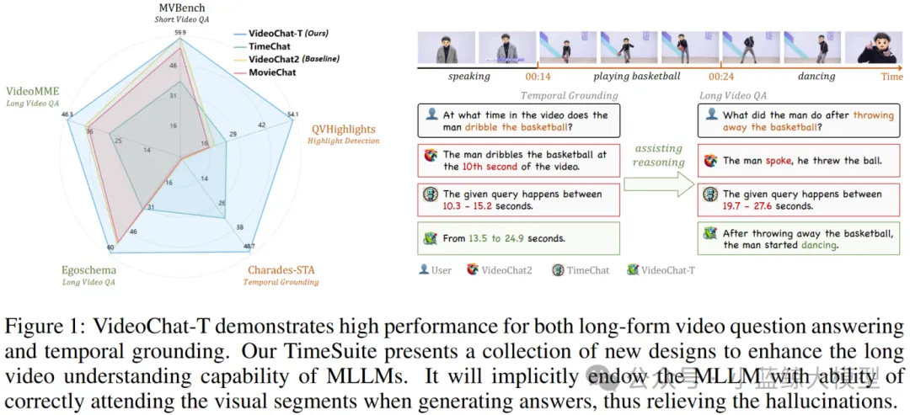
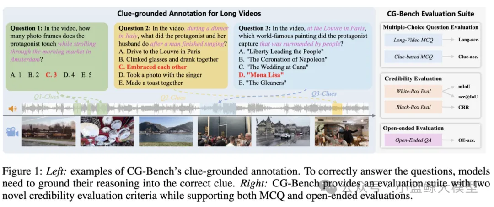
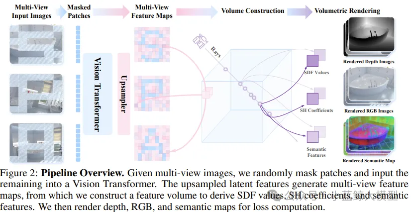
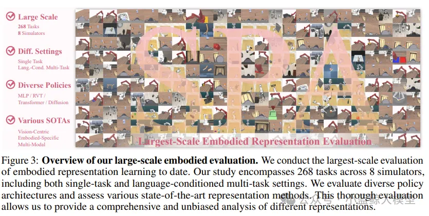
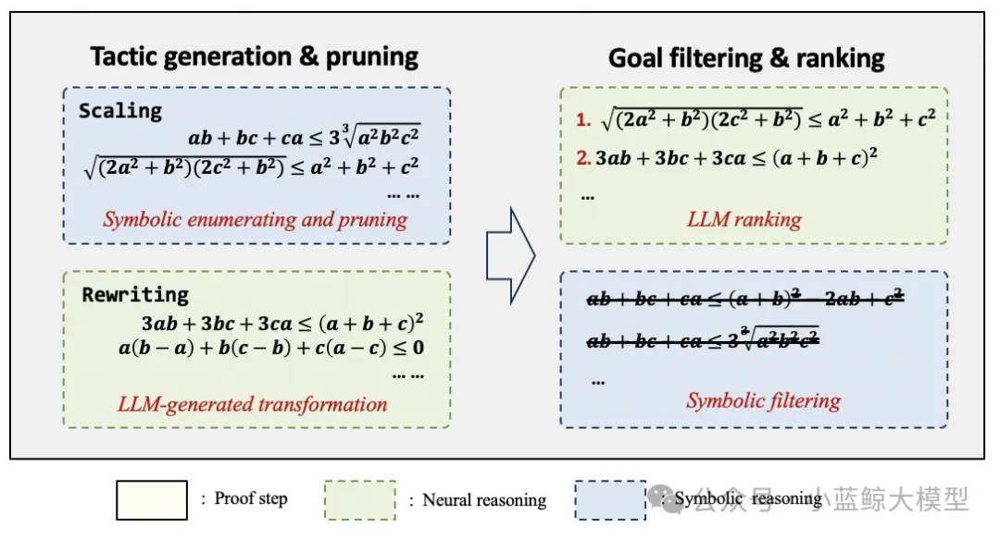
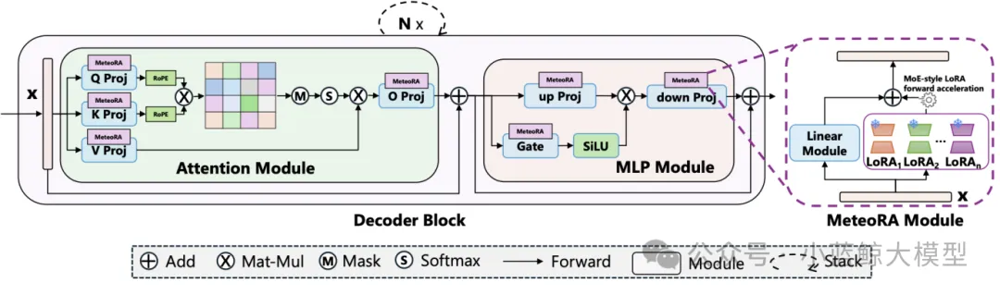

> ICLR（International Conference on Learning Representations）是人工智能领域中专注于深度学习和表征学习的顶级学术会议之一。自2013年首次举办以来，ICLR迅速成为机器学习研究的前沿平台，尤其在深度学习、神经网络架构、强化学习、生成模型、自然语言处理等领域具有广泛的影响力。
>
> 南京大学计算机学院大模型中心有5篇论文被ICLR 2025录用。

# 01

**题目：** TimeSuite: Improving MLLMs for Long Video Understanding via Grounded Tuning  
**作者：** Xiangyu Zeng, Kunchang Li, Chenting Wang, Xinhao Li, Tianxiang Jiang, Ziang Yan, Songze Li, Yansong Shi, Zhengrong Yue, Yi Wang, Yali Wang, Yu Qiao, Limin Wang  
**单位：** 南京大学、上海人工智能实验室、中科院等  
**链接：** https://openreview.net/forum?id=nAVejJURqZ  
**论文简介：** 目前的大多数视频多模态大模型在进行长视频理解时容易关注到与问题不相关的片段，从而经常出现幻觉。是否能够通过将时序定位作为辅助任务，通过准确定位到相关事件的长视频子片段，以提升多模态大模型在长视频问答任务上的表现？针对以上动机，本文提出了TimeSuite，一种利用时间定位数据对短视频MLLMs进行增量微调，从而增强其长视频理解能力的有效方法。具体来说，TimeSuite包含一个处理长视频序列的简单高效框架（VideoChat-T），一个高质量的基于定位的指令调优数据集（TimePro），以及一个精心设计的指令调优任务（Temporal Grounded Caption）。通过联合使用以上组件对MLLMs进行指令微调后，可以有效引导MLLMs在回答问题时关注正确的片段，从而提升长视频问答的准确率。本文具有两个核心亮点：其一，无需依赖任何外部专家解码器，所提出的VideoChat-T可以在时序定位任务中实现专家级的性能，同时保持相当的泛化QA能力和强大的零样本能力。其二，通过引入专家任务的增强了MLLM对长视频的全面理解，验证了通过整合专家任务来增强MLLM综合能力的可行性。实验结果表明，TimeSuite为提高短视频MLLM的长视频理解能力提供了一个成功的解决方案，VideoChat-T相较于原模型在Egoschema和VideoMME等长视频问答测试基准上的准确率分别提高了5.6%和6.8%。此外，VideoChat-T显示了强大的零样本时间定位能力，显著优于现有的最先进的视频多模态大模型。经过进一步微调后，它的性能甚至可以比肩传统的有监督时间定位专家模型。

# 02

**题目：** CG-Bench: Clue-grounded Question Answering Benchmark for Long Video Understanding  
**作者：** Guo Chen, Yicheng Liu, Yifei Huang, Yuping He, Baoqi Pei, Jilan Xu, Yali Wang, Tong Lu, Limin Wang  
**单位：** 南京大学、上海人工智能实验室、复旦大学、浙江大学  
**链接：** https://openreview.net/forum?id=le4IoZZHy1  
**论文简介：** 本文重点讨论了一个面向长视频多模态理解与推理的新型评测基准——CG-Bench，该基准通过构建“线索-问题-答案”三元组体系，深入挖掘视频大模型在复杂情境中实际推理能力，旨在解决当前多选题评测方法带来的“虚高”问题。与传统评测不同，CG-Bench强调模型不仅要回答正确，还必须能够精准定位视频中支撑答案的关键线索片段。评测体系涵盖三类任务：感知型问题评估基础视觉能力，推理型问题要求跨时间整合多模态信息，而幻觉检测则检验模型在缺乏明确线索时是否会作出不可信判断。为进一步提高评估的可信度，CG-Bench引入双重评估机制：白盒评估以IoU衡量模型能否精确定位视频线索，黑盒评估通过Clue Recovery Rate考察模型在处理长视频上下文稀释问题中的能力。此外，该基准还融合了多选与开放式问答形式，并利用人工标注结合启发式规则，提升开放问答的评估质量。数据集包含1219个长视频，覆盖638个三级类别，共计12129个问答对，确保任务的多样性和挑战性。评估结果显示，虽然GPT-4o等主流模型在多选题中表现尚可，但在需要同时完成推理与线索定位的场景下准确率急剧下降，其白盒评估下的acc@IoU仅为4.38%，开放式问答正确率也不足40%。实验发现，模型性能受视频长度、帧数抽样策略和多模态信息影响显著，当前模型在精确检索和利用关键信息方面仍面临巨大挑战，揭示出多模态长视频推理仍是一项亟待攻克的核心难题。

# 03

**题目：** SPA: 3D Spatial-Awareness Enables Effective Embodied Representation  
**作者：** Haoyi Zhu, Honghui Yang, Yating Wang, Jiange Yang, Limin Wang, Tong He  
**单位：** 中科大、上海人工智能实验室、浙江大学、同济大学、南京大学  
**链接：** https://openreview.net/forum?id=6TLdqAZgzn  
**论文简介：** 空间智能是机器人在复杂环境中进行交互和操作的核心能力，增强空间感知对于提高机器人在具身智能任务中的表现至关重要。然而现有方法在三维空间感知上存在局限性，难以有效捕获环境的空间几何结构信息。针对这一问题，本研究提出了视觉表征学习框架SPA，通过增强三维空间感知来提高在具身智能任务中的表示学习能力。SPA从合成室内场景和真实世界机器人交互场景中构建了一个含有相机位姿、深度图以及语义特征图标注的大规模多视角数据集进行训练。训练时，SPA基于多视角图像和相机位姿构建三维体积特征，进而结合掩码技术及可微神经渲染生成RGB图、深度图和语义图，同时通过Eikonal正则化和SDF监督进一步提升三维几何一致性。经过6000 GPU小时训练的SPA在真实环境和八个仿真环境的200余项任务中平均性能优于其他基线方法，其中在高达30.3%的任务中排名第一。

# 04

**题目：** Proving Olympiad Inequalities by Synergizing LLMs and Symbolic Reasoning  
**作者：** Zenan Li(李泽南)，Zhaoyu Li(李照宇)，Wen Tang(唐文)，Xian Zhang(张宪)，Yuan Yao(姚远)，Xujie Si(司旭杰)，Fan Yang(杨凡)，Kaiyu Yang(杨凯峪)，Xiaoxing Ma(马晓星)  
**单位：** 南京大学、多伦多大学、微软亚洲研究院、北京大学、Meta  
**链接：** https://openreview.net/forum?id=FiyS0ecSm0  
**论文简介：** 近期，以大模型为代表的AI技术在竞赛级别数学证明题的求解上取得了显著进展。以不等式证明为例，这类问题因其巨大的搜索空间而极具挑战性——在证明的每一步，模型可能面临超过一万种潜在的选择，这使得传统方法难以高效解决。针对这一难题，南京大学软件所科研团队提出了神经符号式不等式证明系统，通过深度融合神经网络与符号推理的优势，在奥林匹克级别的不等式证明任务中展现了卓越的性能。目前，该系统在标准测试集上的表现已超越人类金牌选手水平：人类金牌选手平均能解答15题（共20题），而我们的系统成功解出16题，显著领先于GPT和DeepSeek等主流AI模型。这一突破不仅验证了神经符号方法在复杂数学推理中的强大潜力，也为AI在自动定理证明、教育辅助和科研探索等领域的应用开辟了新的可能性。

# 05

**题目：** MeteoRA: Multiple-tasks Embedded LoRA for Large Language Models  
**作者：** Jingwei Xu(徐经纬)、Junyu Lai(赖俊宇)、Yunpeng Huang(黄云鹏)  
**单位：** 南京大学  
**链接：** https://openreview.net/pdf?id=yOOJwR15xg  
**论文简介：** 在大语言模型领域中，“预训练 + 微调范式”已经成为了部署各类下游应用的重要基础，而其中低秩适应技术（LoRA）是大模型参数高效微调中最流行的方法之一，而在搭载多个 LoRA 适配器的单一大语言模型上，自主任务感知和切换方面一直存在挑战。在此背景下，本文提出了一个可扩展、高效的多任务嵌入架构 MeteoRA。该框架通过引入全模式混合专家模型（MoE）的方式，将多个特定任务的 LoRA 适配器和一个路由组件嵌入到基座模型上，从而让基座模型具有了根据用户的输入自适应选择合适的适配器处理输入的能力，进而能够同时解决多个正交的下游任务。该框架还包括了一个新颖的混合专家模型前向加速策略，根据多 LoRA 适配器模型结构的特殊性实现了基于 PyTorch 和 Triton 的定制化算子，从而规避了经典 MoE 架构中路由的 for 循环实现的效率瓶颈，文中实验表明该加速策略能够实现平均意义上 4 倍的加速效果。此外，本文发现配备了 MeteoRA 框架的大语言模型在处理复合问题时具有卓越的性能，可以在一次推理中高效地解决十个串行输入的不同问题，此外还观察到在复合问题中，路由组件在不同的输入输出的部分中具有明显的倾向性，进而证明了该方法具备自适应的 LoRA 适配器切换能力。

<a href="https://mp.weixin.qq.com/s/iG5D5n4EXy1MrG4riTt1ag" target="_blank">查看原文</a>