> CVPR（计算机视觉和模式识别会议）是国际上最具影响力的年度学术会议之一，专注于计算机视觉、模式识别及相关领域的前沿研究。每年，它汇聚了全球顶尖的研究人员、学者及工业界人士，共同探讨最新的技术进步与创新应用。会议内容广泛，包括图像处理、机器学习、三维重建、视频分析等众多主题。所有提交的论文都需经过严格的同行评审过程，确保展示的研究成果具有高度的原创性和学术价值。在2024年谷歌学术指标（Google Scholar Metrics）中，CVPR在全球所有期刊和会议中排名第二，仅次于Nature。
>
> 南京大学计算机学院大模型中心有12篇论文被CVPR 2025录用。

# 01

**题目：** UniAP: Unifying Inter- and Intra-Layer Automatic Parallelism by Mixed Integer Quadratic Programming  
**作者：** Hao Lin (林昊), Ke Wu (吴轲), Jie Li (李杰), Jun Li (李俊), Wu-Jun Li (李武军)  
**单位：** 南京大学  
**链接：** https://arxiv.org/abs/2307.16375  
**论文简介：** 大模型的训练往往需要多机多卡的分布式训练。大模型的分布式训练挑战巨大，即使硬件足够，很多人大概率（我们实验中验证有64%-87%的概率）会因为超参数设置（模型怎么切分和排布、数据怎么切分和排布等）不合理而跑不出结果。此外，很多人在碰到大模型训练慢时只会想到增加GPU等硬件，而忽略了或者没意识到分布式训练算法的作用。实际上，分布式训练算法会极大地影响硬件的算力利用率。高效能分布式训练算法具有高算力利用率。用同样的硬件算力训练同一个模型，高效能分布式训练算法会比低效能分布式训练算法速度快，最高可能会快数倍甚至数十倍以上；或者说，训练同一个模型，高效能分布式训练算法会比低效能分布式训练算法成本低，最高可能会节省数倍甚至数十倍以上的算力成本。很多已有的分布式训练算法的效能较低，甚至可能导致机器和GPU卡越多、训练速度越慢的结果。在本文中，我们研发了高效能分布式训练算法UniAP并基于UniAP研发了相应的大模型分布式训练平台和框架。UniAP是首个能实现层类并行策略（张量并行等）和层间并行策略（流水线并行等）联合优化的工作。给定模型和硬件平台，UniAP能够通过自动搜索找到高效能的分布式训练方案，既解决了效率和成本问题（我们实验中，比已有的最好方法最高快3.8倍，比不采用并行策略优化的算法最高快9倍），也解决了很多人在大模型分布式训练时因为超参数设置（模型怎么切分和排布、数据怎么切分和排布等）不合理而跑不出结果的问题。我们还实现了UniAP跟国产AI计算卡的适配。相关工作为大模型训练的降本增效提供了核心技术和（国产）平台。本文被CVPR 2025录用为Oral（所有投稿论文的0.7%，所有录用论文的3.3%）。

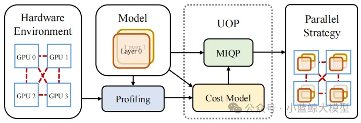

# 02

**题目：** Balanced Direction from Multifarious Choices: Arithmetic Meta-Learning for Domain Generalization  
**作者：** Xiran Wang（王曦染）, Jian Zhang（张剑）, Lei Qi（祁磊）, Yinghuan Shi（史颖欢）  
**单位：** 南京大学、东南大学  
**链接：** https://arxiv.org/abs/2503.18987  
**论文简介：** 领域泛化旨在应对源域（训练集）与未见目标域（测试集）之间由于分布差异所引发的迁移挑战。目前广泛采用的一阶元学习方法基于梯度对齐理论，通过在多个源域之间寻找平衡参数，有效缓解了模型对单一域的过拟合，展现出良好的泛化能力。然而，我们的研究发现：能够推导出梯度对齐的优化路径并非唯一，现有方法实际上仅探索了其中的一种方向。更重要的是，梯度对齐理论虽强调方向的一致性，却忽略了模型最终在参数空间中收敛位置的讨论。理想的平衡参数应更接近各源域最优解的质心位置。为此，本文提出一种简洁而高效的等差算数元学习（Arithmetic Meta-Learning）策略。该方法在遵循梯度对齐原则的基础上，首次将参数平均思想引入元学习，设计出基于等差梯度的优化策略，用以模拟源域最优参数质心的估计过程，同时保持梯度方向的一致性。无需引入额外的专家网络或显式正则项，Arith仅通过简单的加权策略，便可在多个基准数据集上实现良好的泛化性能。

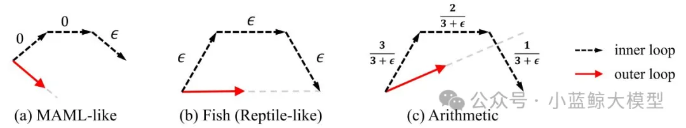

# 03

**题目：** Steady Progress Beats Stagnation: Mutual Aid of Foundation and Conventional Models in Mixed Domain Semi-Supervised Medical Image Segmentation  
**作者：** Qinghe Ma（马庆贺）, Jian Zhang（张剑）, Zekun Li（李泽昆）, Qian Yu（于谦）, Lei Qi（祁磊）, Yinghuan Shi（史颖欢）  
**单位：** 南京大学、东南大学  
**链接：** https://arxiv.org/abs/2503.16997  
**论文简介：** 大规模预训练的视觉基础模型展现出出色的通用能力。然而，当将这些模型适配到特定领域的下游任务时，其固有的海量先验知识可能成为一把“双刃剑”。在存在分布不一致的医学图像分割场景中，MedSAM等基础模型往往会产生过度自信的预测，其中部分预测存在错误。这种错误积累会阻碍未标注数据的有效利用，限制模型性能的进一步提升。本文提出一种基础模型与传统模型的协同训练框架（SynFoC）来解决该问题。课题组发现，从头开始训练的传统模型能够修正基础模型的高置信度错误预测，而基础模型在训练早期阶段可为传统模型提供高质量的伪标签监督。具体地，该方法1）充分利用基础模型强大的泛化能力，避免传统模型在少量标注样本上的过拟合风险；2）同时借助传统模型的稳健自纠正能力，引导基础模型纠正高置信错误预测，动态平衡两模型在不同训练阶段的主导地位。在方法层面，通过引入Self-Mutual Confidence（SMC）动态评估模块，度量来自传统模型的伪标签质量，动态调整两模型伪标签的融合权重。同时，基于共识-分歧的一致性约束进一步增强了两模型的协同表征能力。实验结果表明，所提出的方法表现均优于现有其他方法。

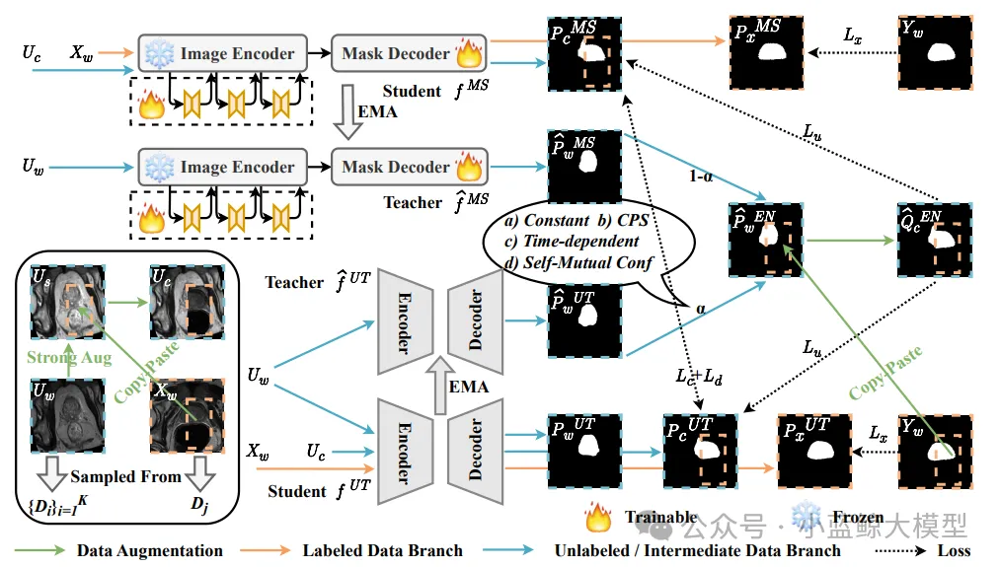

# 04

**题目：** Taste More, Taste Better: Diverse Data and Strong Model Boost Semi-Supervised Crowd Counting  
**作者：** Maochen Yang（杨茂琛）, Zekun Li（李泽昆）, Jian Zhang（张剑）, Lei Qi（祁磊）, Yinghuan Shi（史颖欢）  
**单位：** 南京大学、东南大学  
**链接：** https://arxiv.org/abs/2503.17984  
**论文简介：** 人群计数为计算机视觉、模式识别中的重要应用，其在智慧城市、公共安全等领域至关重要。然而精确标注大量数据成本高昂。半监督人群计数旨在利用易于获取的无标签数据，但如何有效利用这些数据仍是挑战。针对现有方法在数据增强适用性和模型全局上下文捕捉能力上的局限，本研究提出了一个名为TMTB (Taste More Taste Better) 的新框架。该框架从“数据”和“模型”两方面入手：本研究设计了一种特别适用于人群计数任务的Inpainting Augmentation技术。通过利用扩散模型对图像背景进行修复式生成，该技术能在不破坏前景人群结构完整性的前提下，有效增加训练数据的多样性，并设计了机制过滤不可靠的生成区域。本研究引入了视觉状态空间模型 (Visual State Space Model, VSSM) 作为骨干网络。VSSM能以线性复杂度有效捕捉全局上下文信息，尤其适用于处理极端拥挤、低光照或恶劣天气等复杂场景。此外，本研究还加入了一个抗噪声分类头，它提供相对模糊但更鲁棒的区间计数监督信号，有效缓解了回归头对标注噪声敏感的问题。本研究在多个主流数据集上进行了广泛实验。结果表明，TMTB在不同标注比例（如5%, 10%, 40%）下均显著超越了现有SOTA方法。特别地，在仅用5%标注数据的JHU-Crowd++数据集上，本研究将MAE首次降至70以下，达到67.0。同时，TMTB在跨域泛化任务上也展现出优异性能。

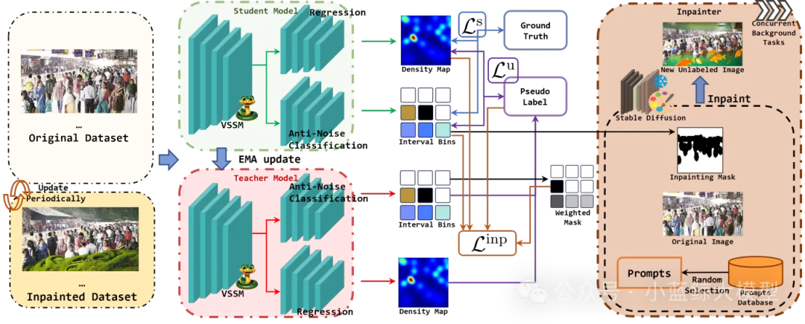

# 05

**题目：** AutoLUT: LUT-Based Image Super-Resolution with Automatic Sampling and Adaptive Residual Learning  
**作者：** Yuheng Xu (许煜恒), Shijie Yang (杨世杰), Xin Liu (刘鑫), Jie Liu (刘杰), Jie Tang (唐杰), Gangshan Wu (武港山)  
**单位：** 南京大学  
**链接：** https://arxiv.org/abs/2503.01565  
**论文简介：** 近年来，高分辨率屏幕（Hi-DPI）的日益普及推动了对高清图像的需求增长。然而，边缘设备有限的计算能力给复杂超分辨率神经网络的部署带来了挑战，这凸显了对高效方法的迫切需求。尽管先前的研究已取得显著进展，但尚未充分挖掘像素级信息。此外，这些方法依赖固定采样模式，既限制了精度，也制约了对低分辨率图像细微特征的捕捉能力。为应对这些挑战，我们提出了两个即插即用模块，旨在基于查找表（LUT）的超分辨率网络中高效捕获并利用像素信息。我们的方法首创了自动采样（AutoSample）技术，这是一种灵活的LUT采样方案——采样权重在训练过程中自动学习，既能适应像素变化，又可扩展感受野且不增加推理成本。同时，我们采用自适应残差学习（AdaRL）来增强层间连接，促进细节信息流动，从而提升网络重建精细特征的能力。该方法在保持存储空间相近的情况下，为MuLUT和SPF-LUT模型均带来显著性能提升：对于MuLUT模型，在五个数据集上平均获得约+0.20 dB的PSNR提升；对于SPF-LUT模型，在存储空间减少超50%、推理时间缩短约三分之二的情况下，仍保持与原模型相当的复原效果。

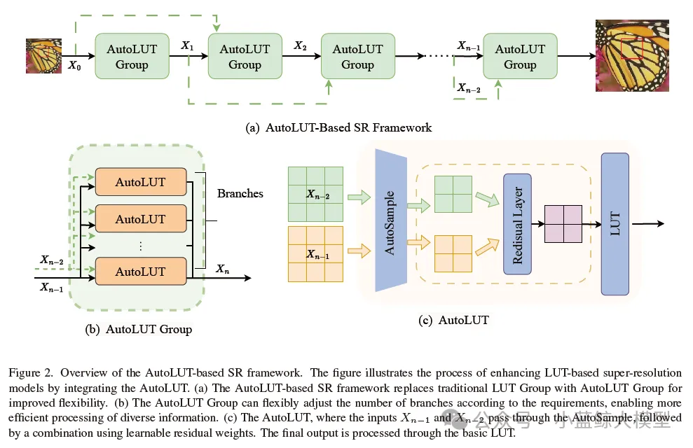
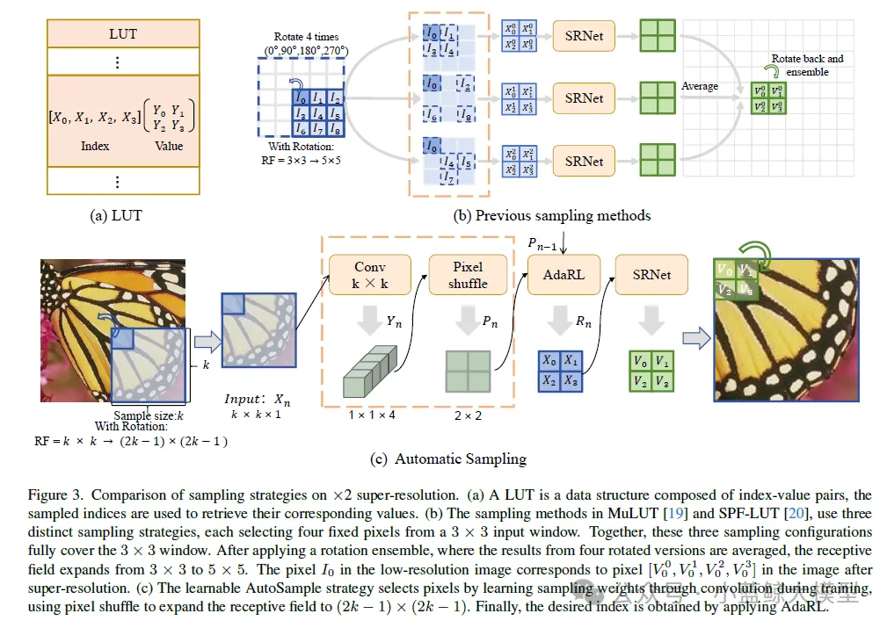

# 06

**题目：** CATANet: Efficient Content-Aware Token Aggregation for Lightweight Image Super-Resolution  
**作者：** Xin Liu (刘鑫), Jie Liu (刘杰), Jie Tang (唐杰), Gangshan Wu (武港山)  
**单位：** 南京大学  
**链接：** https://arxiv.org/abs/2503.06896  
**论文简介：** 基于Transformer的方法在图像超分辨率（Image Super-Resolution, SR）等低级视觉任务中表现出了卓越的性能。然而，随着空间分辨率的提高，其计算复杂度呈平方级增长。为缓解该问题，已有一系列研究尝试将低分辨率图像划分为局部窗口、轴向条带或空洞窗口进行处理。SR任务通常依赖于图像的冗余信息进行重建，而这种冗余不仅存在于局部区域，也广泛存在于远距离区域。然而，现有方法普遍将注意力计算限制于内容无关的局部区域，直接限制了注意力机制捕捉长距离依赖的能力。为解决上述问题，本文提出了一种轻量级的内容感知Token聚合网络（Content-Aware Token Aggregation Network, CATANet）。具体而言，我们设计了一种高效的内容感知Token聚合模块，用于聚合长距离内容相似的Token。该模块通过在整个图像Token范围内共享聚合中心，并仅在训练阶段更新聚合中心，从而有效降低计算成本。随后，我们引入组内自注意力机制以实现长距离信息交互，并进一步设计了组间交叉注意力机制以增强全局信息的融合能力。实验结果表明，与当前最先进的基于聚类的方法SPIN相比，CATANet在保持更高推理速度的同时，在峰值信噪比（PSNR）方面最高提升了0.33dB，显示出更优的性能表现。

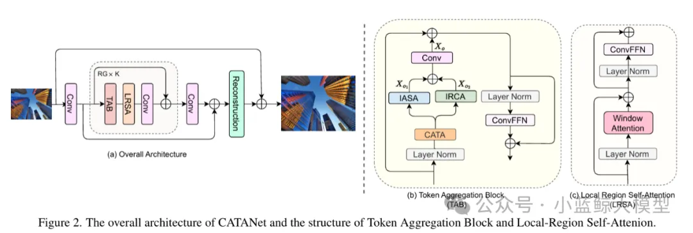

# 07

**题目：** Tra-MoE: Learning Trajectory Prediction Model from Multiple Domains for Adaptive Policy Conditioning  
**作者：** Jiange Yang, Haoyi Zhu, Yating Wang, Gangshan Wu, Tong He, Limin Wang  
**单位：** 南京大学、上海人工智能实验室、中科大、同济等  
**链接：** https://arxiv.org/pdf/2411.14519  
**论文简介：** 数据稀缺性和异构化是机器人学习领域所面临的长期挑战。本研究提出了基于稀疏门控混合专家架构的轨迹预测模型Tra-MoE。Tra-MoE通过更好地平衡参数协作化和参数专用化进而从大规模、跨域、无需动作标签的视频数据中学习泛化性更强且性能超过同等参数量密集基线的轨迹预测模型，成功实现了通专融合的网络架构，同时显著降低了机器人系统对采集成本高昂的真机数据需求。Tra-MoE有效结合了不同物理引擎渲染的仿真视频以及真实环境中人类、单机械臂和双机械臂的跨智能体异构操作视频，在跨智能体学习领域中具有重要的研究前景。此外，本研究提出了一种自适应的策略条件化技术，能够更有效地利用预测轨迹对机器人策略进行引导，从而显著提升下游机器人策略执行的性能。

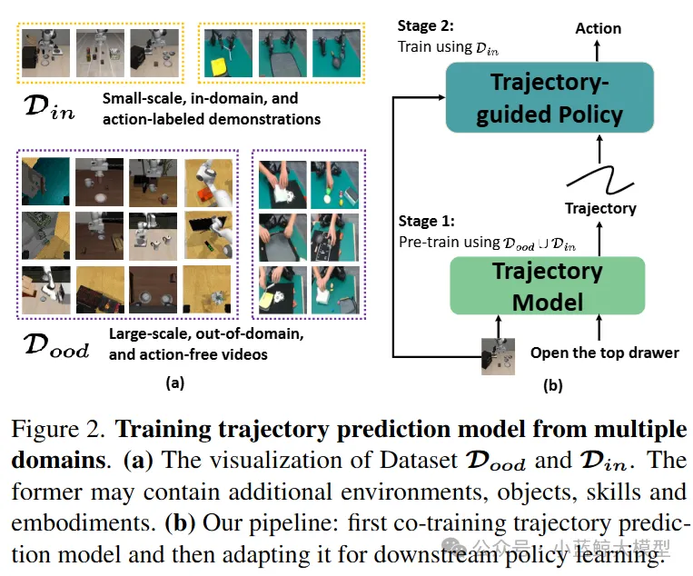

# 08

**题目：** LeviTor: 3D Trajectory Oriented Image-to-Video Synthesis  
**作者：** Hanlin Wang, Hao Ouyang, Qiuyu Wang, Wen Wang, Ka Leong Cheng, Qifeng Chen, Yujun Shen, Limin Wang  
**单位：** 南京大学，蚂蚁研究院，浙江大学，香港科技大学，上海人工智能实验室  
**链接：** https://github.com/ant-research/LeviTor  
**论文简介：** 利用用户绘制轨迹的方式完成交互的直观性使其在图像到视频合成任务（Image-to-Video Synthesis）中控制物体如何运动的应用越来越广泛。然而，现有的在2D空间中绘制物体运动轨迹的方法在处理平面以外的运动时通常会面临歧义性问题，即同样的2D运动轨迹在3D空间中可能对应多条运动路径。在这项工作中，我们通过引入一个新的维度——深度维度——来增强这种交互方式，让用户能够为轨迹上的关键点分配相对深度值。这样，我们的新交互范式不仅继承了2D轨迹交互的便利性，还增加了在3D空间中的轨迹控制，从而拓宽了用户创作的范围。具体地说，我们提出了一种用于图像到视频合成中的3D轨迹控制的开创性方法，将物体用少量聚类点表示，来反映物体的远近变化和遮挡情况。这些聚类点连同深度信息和实例信息一起作为生成控制信号被输入到一个视频扩散模型中完成视频生成。大量实验验证了我们的方法（称为LeviTor）在从静态图像生成逼真视频时精确操控物体运动的有效性。

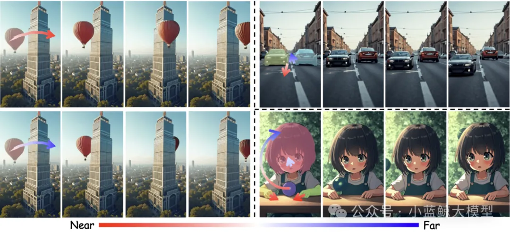

# 09

**题目：** Contextual AD Narration with Interleaved Multimodal Sequence  
**作者：** Hanlin Wang, Zhan Tong, Kecheng Zheng, Yujun Shen, Limin Wang  
**单位：** 南京大学，鲁汶大学，蚂蚁研究院，上海人工智能实验室  
**链接：** https://arxiv.org/abs/2403.12922  
**论文简介：** 影像口述（AD）任务旨在为视障人士生成视觉信息的语言描述，以帮助他们获取长视频内容（如电影、电视剧）的信息。通过以视频特征、文本、角色库和上下文信息作为输入，影像口述能够通过角色名称对应到具体的角色人物，并提供合理且符合上下文的描述，以帮助观众理解电影的情节。为了实现这一目标，我们提出了一种简单且统一的框架，利用预训练的基础语言模型，通过交错的多模态序列作为输入来生成影像口述内容，称为 Uni-AD。为了在不同模态之间实现更细粒度的特征对齐，我们引入了一个简单而轻量级的模块，将视频特征映射到文本特征空间。此外，我们还提出了一个角色优化模块，通过识别在视频上下文中发挥更重要作用的主要角色，来提供更精确的角色信息。结合这些设计，我们进一步将上下文信息和对比损失函数融入架构中，以生成更加流畅且符合上下文的影像口述内容。在多个影像口述数据集上的实验表明，Uni-AD 在影像口述生成任务中表现优异，证明了我们方法的有效性。

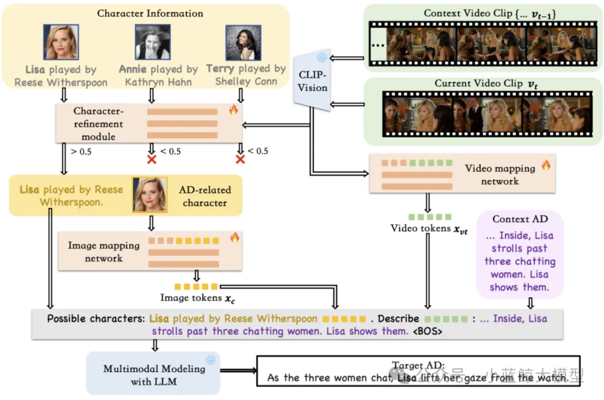

# 10

**题目：** Multiple Object Tracking as ID Prediction  
**作者：** Ruopeng Gao，Ji Qi，Limin Wang  
**单位：** 南京大学，中国移动（江苏）软件技术有限公司，上海人工智能实验室  
**链接：** https://github.com/MCG-NJU/MOTIP  
**论文简介：** 多目标跟踪是视频理解中一个长久以来的挑战。一个自然且直观的方法是将其划分成为两个子任务：目标检测和关联。主流的方法采用复杂的手工算法来维护轨迹信息并且计算用于目标匹配的代价矩阵。尽管这些方法取得了令人满意的跟踪性能，但是它们在适应复杂场景时往往需要一系列繁杂的手工修改。我们认为这样人为的先验假设限制了模型的适应性与灵活性，使其无法在特定数据域上取得最优跟踪效果。因此，我们提出了一种新的视角：将多目标跟踪视作一种基于上下文的ID预测任务，将上述的目标关联流程转变为一种端到端可训练的框架。基于此，我们提出了一个简单并且有效的方法，称做MOTIP。给定包含不同ID的过往轨迹的集合，MOTIP直接解码当前检测结果的ID标签从而完成目标关联流程。不需要额外繁杂的技巧和设计，我们的方法仅仅使用目标外观特征作为跟踪线索就在多个基准上取得了最优性能。如此简单的设计和令人振奋的表现为未来的改进留下了充足的空间，表明其可以作为后续研究的一个富有潜力的基线方法。

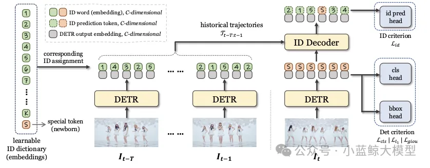

# 11

**题目：** Online Video Understanding: OVBench and VideoChat-Online  
**作者：** Zhenpeng Huang, Xinhao Li, Jiaqi Li, Jing Wang, Xiangyu Zeng, Cheng Liang, Tao Wu, Xi Chen, Liang Li, Limin Wang  
**单位：** https://videochat-online.github.io/  
**链接：** 南京大学，中国移动研究院，上海人工智能实验室  
**论文简介：** 多模态大语言模型（MLLMs）在离线视频理解方面取得了显著进展。然而，将这些模型应用于实际场景，如自动驾驶和人机交互，面临着独特的挑战，因为需要实时处理连续的在线视频流。为此，本文从三个方面提出了系统性的努力：评估基准、模型架构和训练策略。首先，我们介绍了OVBench，一个综合性的问题回答基准，旨在评估模型在在线视频上下文中的感知、记忆和推理能力。该基准包含6种核心任务类型，涵盖了三种时间上下文——过去、当前和未来——并形成了来自多种数据集的16个子任务。其次，我们提出了一种新的金字塔记忆库（Pyramid Memory Bank），有效地保留了视频流中的关键时空信息。第三，我们提出了一种离线到在线的学习范式，设计了适用于在线视频数据的交替对话格式，并构建了一个专门用于在线视频训练的指令调优数据集VideoChatOnline-IT。基于上述要点，本文构建了在线视频理解框架——VideoChat-Online，强大且高效的在线视频理解模型。尽管计算成本较低且效率较高，VideoChat-Online在流行的离线视频基准和OVBench基准上均优于现有的最先进离线和在线模型，证明了我们模型架构和训练策略的有效性。

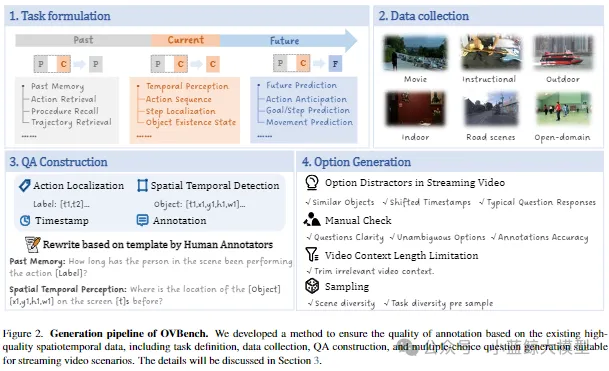
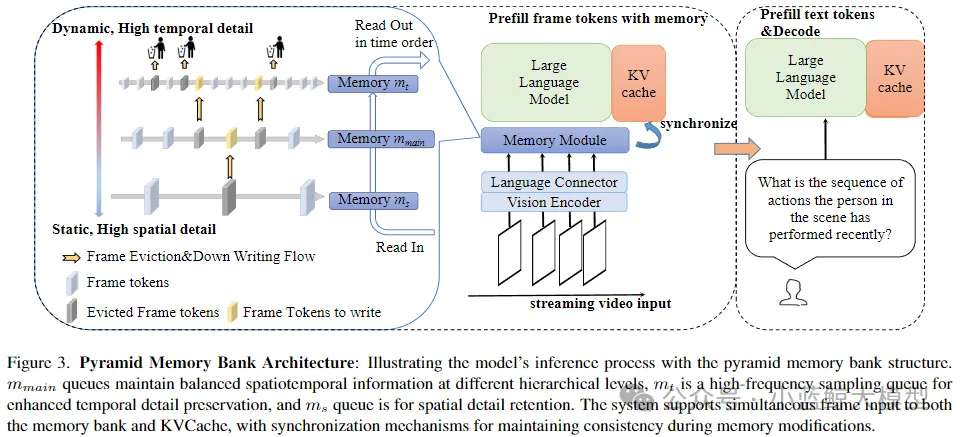

# 12

**题目：** Task Preference Optimization: Improving Multimodal Large Language Models with Vision Task Alignment  
**作者：** 晏子昂，李志林，何逸楠，王晨汀，黎昆昌，李新浩，曾祥宇，王子磊，王亚立，乔宇，王利民，王毅  
**单位：** 上海人工智能实验室，浙江大学，中国科学技术大学，上海交通大学，中国科学院深圳先进技术研究院，南京大学  
**论文简介：** 当前的多模态大语言模型（MLLMs）尽管在广泛的视觉应用中展现出卓越的感知与推理能力，但在处理细粒度或高精度视觉理解任务时仍面临显著挑战。近期的研究主要聚焦于两种策略：其一是开发工具使用能力，其二是将特定视觉任务整合到自回归框架中。然而，这些方法往往以牺牲整体多模态性能为代价，难以兼顾通用性与任务特定性能的平衡。为解决这一问题，并以可扩展的方式提升MLLM在多样化视觉任务中的表现，本文提出了一种新颖的方法——任务偏好优化（Task Preference Optimization, TPO）。该方法利用从细粒度视觉任务中提取的可微分任务偏好，实现了对多模态模型的有效优化。TPO的核心创新在于引入了可学习的任务标记，这些标记在多个任务特定头部与MLLM之间建立了动态连接。通过在训练过程中充分利用丰富的视觉标注数据，TPO不仅显著提升了MLLM的多模态表征能力，还在特定任务上的性能得到了显著增强。此外，TPO支持多任务联合训练，实验结果表明，这种多任务协同机制能够带来超越单一任务训练方法的性能提升，体现了任务间知识迁移的协同效应。我们将TPO方法实例化为两个代表性模型——VideoChat和LLaVA，并通过实验验证了其优越性。与基线模型相比，TPO使多模态性能总体提升了14.6%。更重要的是，MLLM-TPO在多种任务上展现了强大的零样本泛化能力，其性能与当前最先进的监督学习模型相当。综上所述，TPO为多模态大语言模型在复杂视觉任务中的性能优化提供了一种高效且可扩展的解决方案，为未来研究开辟了新方向。

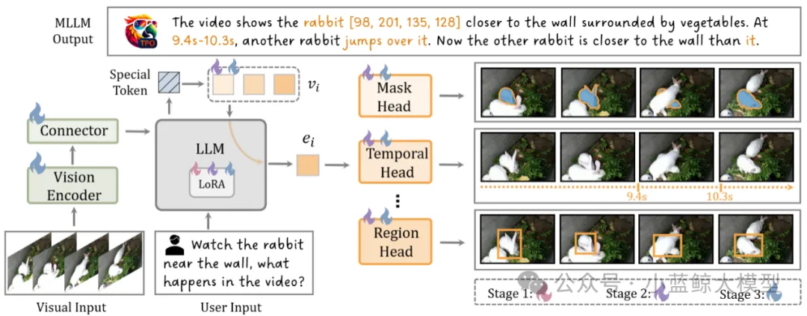

<a href="https://mp.weixin.qq.com/s/RKXp_7lzeO9Ad7axKbcShw" target="_blank">查看原文</a>

