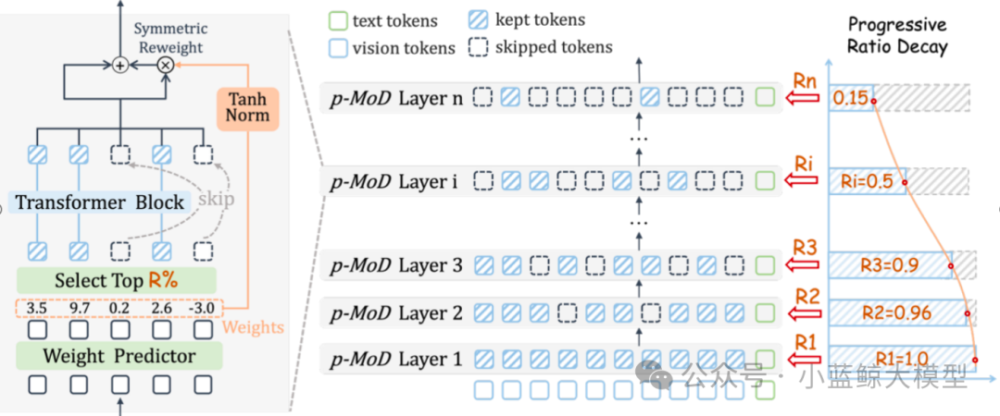
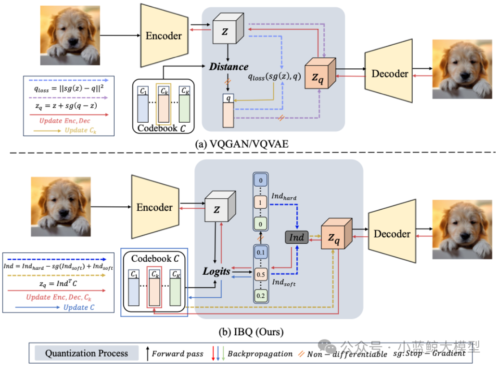
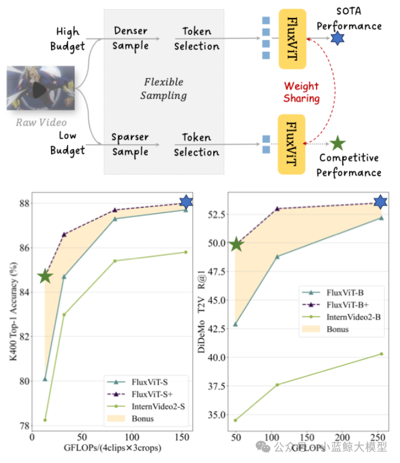
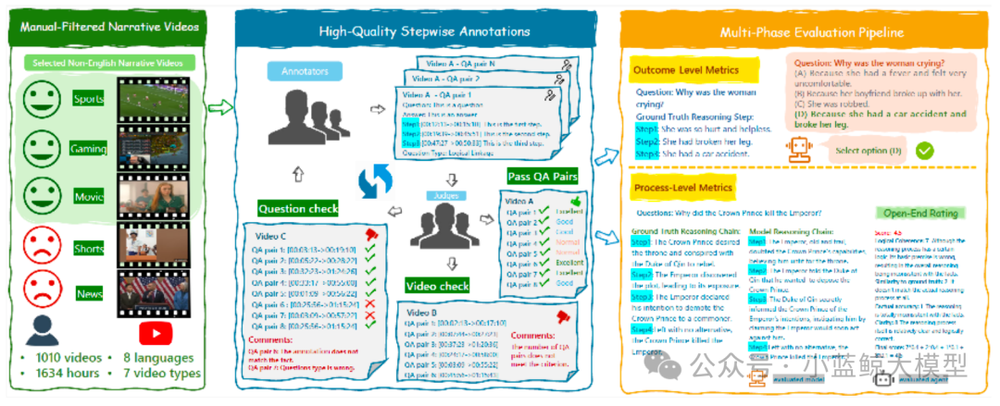
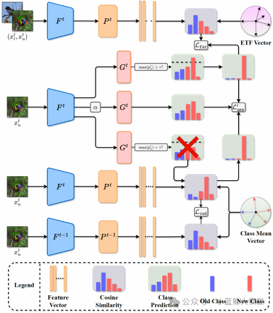
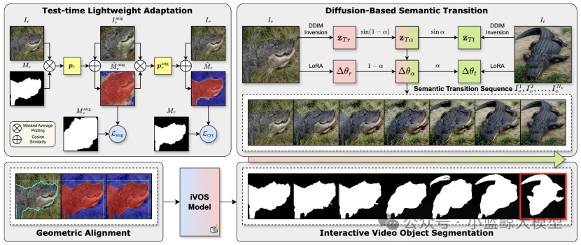

> ICCV（International Conference on Computer Vision）是计算机视觉领域最具影响力的国际顶级学术会议之一，由IEEE计算机学会主办，每两年举办一次，与CVPR、ECCV并称三大视觉会议。会议涵盖图像处理、目标检测、三维重建、视频理解、视觉与语言等前沿研究方向，是全球科研人员展示最新成果、交流思想的重要平台。ICCV的论文录用标准极高，代表了计算机视觉领域的最新技术趋势与研究热点。
>
> 南京大学计算机学院大模型中心有7篇论文被ICCV 2025录用。

# 01

**题目：** MobileViCLIP: An Efficient Video-Text Model for Mobile Devices
**作者：** Min Yang, Zihan Jia, Zhilin Dai, Sheng Guo, Limin Wang
**单位：** 南京大学，蚂蚁集团
**论文简介：**

尽管大型模型在越来越多的视觉任务中取得了良好的效果，但高效的轻量级神经网络由于其更快的推理速度和更易于在移动设备上部署而受到越来越多的关注。然而，现有的视频模型仍然侧重于更大的ViT架构，很少有研究尝试构建高效的架构。鉴于许多高效的对比语言图像预训练 (CLIP) 模型已经展现出强大的零样本分类和检索能力，我们尝试填补视频文本理解模型的空白，并提出了一个快速高效的视频文本模型MobileViCLIP，它具有强大的零样本推理能力，可部署在移动设备上。具体而言，我们的MobileViCLIP在多个文本-视频检索数据集和零样本视频分类数据集上的性能堪比主流的ViT模型，同时将部署在移动设备上时的推理速度提升数十倍。综上所述，MobileViCLIP着眼于视频文本模型在效率方面的改进非常重要，这对该领域而言是宝贵的贡献。

# 02

**题目：** p-MoD: Building Mixture-of-Depths MLLMs via Progressive Ratio Decay
**作者：** Jun Zhang (张峻), Desen Meng (孟德森), Zhengming Zhang (张拯明), Zhenpeng Huang (黄振鹏), Tao Wu (吴涛), Limin Wang (王利民)
**单位：** 南京大学，中国移动研究院
**论文简介：**

尽管多模态大模型（MLLMs）在各种下游任务上表现出色，但其巨大的训练和推理成本阻碍了其进一步发展。造成过大的计算开销的主要原因是：LLM需要处理海量的视觉token。本文提出了p-MoD，一种高效的MLLM架构，在保证模型性能不变的同时，大幅降低其训练和推理时的计算开销。为了减少每一个LLM Transformer层处理的视觉token数量，p-MoD引入了混合深度（Mixture-of-Depths, MoD）机制来构建高效的MLLMs，该机制在每个Transformer层中选择处理关键的视觉tokens进行处理，跳过冗余的tokens。然而，将MoD机制集成到MLLMs中并非易事。为了解决训练和推理稳定性的问题，并应对训练数据有限的挑战，p-MoD对MoD模块进行了结构改进与创新，设计了Tanh门控的权重归一化（TanhNorm）和对称的tokens重加权 (STRing) 解决了上述挑战。更进一步地，本文通过探究实验观察到视觉tokens在更深层中表现出更高的冗余度，因此设计了一种渐进式比率衰减（Progressive Ratio Decay, PRD）策略，逐层逐渐降低MoD机制保留tokens的比例。这一关键设计充分释放了MoD的潜力，显著提升了模型的效率和性能。在15个基准测试中，对LLaVA-1.5和LLaVA-NeXT两个基线模型进行的实验表明，p-MoD 以55.6%的推理TFLOPs，53.7%的KV Cache存储和77.7%的GPU训练时长，得到了匹配甚至超越基线模型的性能。

# 03

**题目：** Scalable Image Tokenization with Index Backpropagation Quantization
**作者：** Fengyuan Shi (石丰源), Zhuoyan Luo (罗卓彦), Yixiao Ge (葛艺潇), Yujiu Yang (杨余久), Ying Shan (单瀛), Limin Wang (王利民)
**单位：** 南京大学，清华大学，腾讯
**论文简介：**

现有的向量量化（VQ）方法在扩展性方面存在困难，主要原因在于训练过程中仅部分更新的代码本易发生不稳定，随着非激活代码与视觉特征之间分布差距的不断扩大，代码本的利用率下降，最终导致崩溃。为了解决这一问题，我们提出了一种新的VQ方法——Index Backpropagation Quantization（IBQ），能够联合优化所有代码本嵌入向量和视觉编码器。通过在编码特征与代码本之间的one-hot类别分布上应用直通估计器（straight-through estimator），IBQ使所有代码都具备可微性，并保持与视觉编码器一致的潜在空间。IBQ实现了视觉tokenizer的可扩展训练，并首次在高维（256）条件下实现了大规模（2¹⁸）且高利用率的代码本。在标准的ImageNet基准上，我们验证了IBQ的扩展能力和优越性能，在图像重建和自回归视觉生成任务上均取得了有竞争力的结果。

# 04

**题目：** Make Your Training Flexible: Towards Deployment-Efficient Video Models
**作者：** 王晨汀，黎昆昌，姜天翔，曾祥宇，王毅，王利民
**单位：** 上海人工智能实验室，上海交通大学，中国科学与技术大学, 南京大学
**论文简介：**

当前主流的视频训练方法通常基于固定时空分辨率的时空采样网格（Sampling Grid）提取固定长度的视觉令牌作为输入，导致模型训练与推理过程严重受限于预设的采样策略。这种刚性设计使得模型难以适应下游任务中不同的计算预算需求——尤其在高计算资源场景下训练出的高性能 Video 模型，在端侧设备等资源受限环境中往往无法直接高效部署。为解决这一问题，我们提出了一种全新的训练范式，旨在实现“全场景无损适配”：既能保持模型在高计算资源下的最优性能，又能使其在端侧低资源环境下实现无损迁移。为此，我们首次提出“令牌优化”（Token Optimization, TO），一种自适应推理框架，通过动态采样与智能令牌选择，使模型能够根据下游计算限制自动优化输入令牌集，最大化信息利用率。基于此目标，我们创新性从训练端地开发了名为 Flux 的数据增强工具，通过实现灵活可变的采样网格并结合令牌选择机制，能够无缝适配主流视频训练框架，以近乎零额外成本显著提升模型鲁棒性和下游的灵活性，使得训练出的单一模型可以在各种计算量限制下自适应推理。我们将 Flux 整合至大规模视频预训练流程，所得模型 FluxViT 在标准计算成本下于多项任务中创造了最新性能纪录。尤为突出的是，在 1/4 令牌量的限制下时，经令牌优化的 FluxViT 仍能媲美先前最优的 InternVideo2 系列模型的性能，实现近 90%的无损计算资源节省。

# 05

**题目：** VRBench: A Benchmark for Multi-Step Reasoning in Long Narrative Videos
**作者：** 于家硕，吴越，褚蒙，任志斐，黄子政，储培，张瑞杰，何逸楠，李奇睿，李松泽，李珍翔，涂中英，何聪辉，乔宇，王亚立，王毅，王利民
**单位：** 上海人工智能实验室，南京大学，中国科学院深圳先进技术研究院
**论文简介：**

我们推出 VRBench——首个专为评估大模型多步推理能力而构建的长篇叙事视频基准测试，解决了现有评估方法忽视时序推理与流程有效性的局限。该基准包含 1,010 条长视频（平均时长 1.6 小时）、9,468 个人工标注的多步问答对，以及 30,292 个带时间戳的推理步骤。这些视频通过包含专家交叉评审的多阶段筛选流程进行收集，重点确保剧情连贯性和情节复杂度。我们开发了一套人机协同框架来生成连贯的推理链，每条推理链均需包含多个带时间戳的推理步骤，涵盖事件归因、隐性推理等七种类型。VRBench 设计了多阶段评估管道，从结果和过程两个层面评估模型性能：除采用选择题评估最终结果外，我们创新性地提出 LLM 引导的过程性评分指标，从多维度全面评估推理链质量。通过对 12 个 LLM 和16 个 VLM 在 VRBench 上的广泛测试，我们开深入分析了现有模型对长视频多步推理能力的不足，并提供了多方面建议。

# 06

**题目：** Divide-and-Conquer for Enhancing Unlabeled Learning, Stability, and Plasticity in Semi-supervised Continual Learning
**作者：** Yue Duan (段岳), Taicai Chen (陈泰财), Lei Qi (祁磊), Yinghuan Shi (史颖欢)
**单位：** 南京大学, 东南大学
**链接：** https://arxiv.org/abs/2508.05316, https://github.com/NJUyued/USP4SSCL
**论文简介：**

半监督持续学习（Semi-supervised Continual Learning, SSCL）旨在从仅有部分数据被标注的连续任务序列中学习，这极具现实意义但挑战重重。其核心挑战在于有效利用无标签数据，同时平衡模型的“记忆稳定性”（不遗忘旧知识）与“学习可塑性”（学习新知识）。现有方法往往孤立地解决其中一两个问题，难以兼顾全局。针对此，本文提出了一个名为USP的“分而治之”的协同框架，通过三个相互关联的模块，系统性地增强无标签学习（Unlabeled Learning）、记忆稳定性（Memory Stability）和学习可塑性（Learning Plasticity）。在增强可塑性方面，我们提出了特征空间预留（FSR）策略。该策略利用等角紧框架（ETF）为未来的新类别预先在特征空间中保留位置，从而在学习新任务时避免与旧类别的特征产生冲突。在无标签学习方面，我们设计了分治伪标签（DCP）方法。该方法将无标签数据分为高置信度和低置信度两部分，并分别采用分类器和更稳健的最近类均值（NCM）进行伪标签分配，从而充分利用所有数据，提高了伪标签的准确性。在维持稳定性方面，我们提出了类均值锚定无标签蒸馏（CUD）。该方法巧妙地复用DCP的中间结果，将无标签数据锚定到由有标签数据计算出的稳定类中心上进行知识蒸馏，有效缓解了模型在无标签数据上的灾难性遗忘。大量实验表明，USP框架显著优于当前SOTA方法，在最终任务准确率方面最高提升5.94%。

# 07

**题目：** Correspondence as Video: Test-Time Adaption on SAM2 for Reference Segmentation in the Wild
**作者：** Haoran Wang (王皓冉), Zekun Li (李泽昆), Jian Zhang (张剑), Lei Qi (祁磊), Yinghuan Shi (史颖欢)
**单位：** 南京大学, 东南大学
**链接：** https://arxiv.org/abs/2508.07759，https://github.com/wanghr64/cav-sam
**论文简介：**

大型视觉模型（如SAM）在处理新领域、新类别的下游分割任务时性能会显著下降。参考分割（Reference Segmentation）利用带标注的参考图像来引导模型分割目标图像，是一个很有前景的解决方案。然而，现有方法大多依赖于元学习（Meta-learning），需要大量的训练数据和计算资源。针对此，本文提出了一种名为CAV-SAM的全新范式，其核心思想是将参考图像与目标图像之间的“对应关系”巧妙地转化为一段“伪视频”。这使得为视频任务设计的最新模型SAM2，仅通过轻量级的测试时微调，就能高效地适应下游分割任务，完全避免了高成本的元学习过程。该框架主要包含两个模块：基于扩散的语义过渡 (DBST): 为解决参考与目标图像间同一类别、不同实例导致的“语义差异”问题，该模块利用扩散模型生成一个从参考图像到目标图像的平滑语义过渡序列（即伪视频）。 测试时几何对齐 (TTGA): 为应对目标物体在姿态、大小上的“几何变化”挑战，该模块在测试时仅使用参考图像，通过一种新颖的“增强循环一致性”损失对SAM2进行轻量化微调。优化后的模型能为伪视频序列生成更精准的提示，从而更好地对齐几何变化。 大量实验证明，CAV-SAM无需元学习，其性能却远超当前SOTA方法，在多个数据集上平均性能提升约5%。

