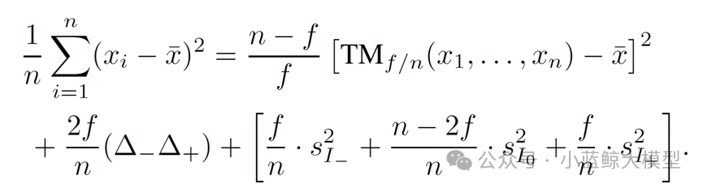
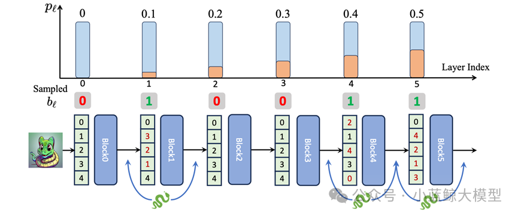
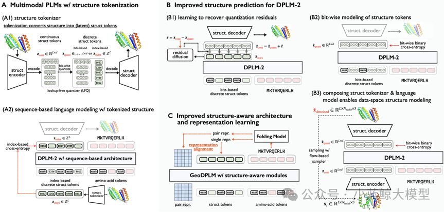
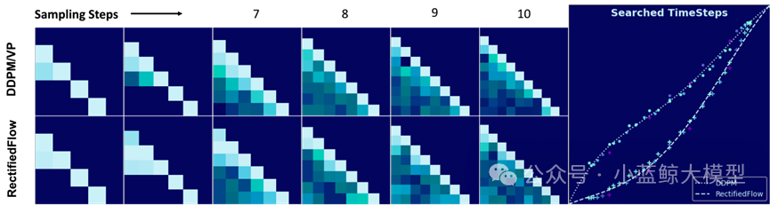

> ICML is one of the most prestigious and influential conferences in machine learning. It is among the longest-running and largest venues in the field and a CCF Class-A conference.
>
> Four papers from the Large Model Center of the Department of Computer Science and Technology, Nanjing University (NJU MCG), have been accepted to ICML 2025.

# 01

**Title:** On the Tension between Byzantine Robustness and No-Attack Accuracy in Distributed Learning
**Authors:** Yi-Rui Yang, Chang-Wei Shi, Wu-Jun Li
**Affiliations:** Nanjing University
**Link:** https://cs.nju.edu.cn/lwj/paper/ICML2025_NFLinBRDL.pdf
**Abstract:**

Distributed machine learning leverages multiple interconnected devices (nodes) and their data to train models. As datasets and models scale up, large clusters face higher rates of software/hardware failures; in open-network scenarios such as federated learning, adversarial attacks are also more likely. Faulty or malicious nodes are called Byzantine nodes. Byzantine-robust distributed learning often uses robust aggregators to withstand such behavior. However, when no Byzantine nodes are present, the effect of robust aggregation is underexplored. This work theoretically analyzes aggregation error in the no-attack setting and proves that the worst-case aggregation error of a robust aggregator increases with the number of Byzantine nodes it is designed to tolerate—revealing an inherent tension between Byzantine robustness and no-attack accuracy. For both non-convex objectives and those satisfying the Polyak–Łojasiewicz (PL) condition, the paper establishes tight lower bounds on the convergence rate of gradient descent with robust aggregation, reflecting the same trade-off. Experiments substantiate the theory and suggest a practical recipe: use robust aggregation during most epochs to prevent crashes/restarts; near convergence, if the cluster is healthy, switch to standard averaging to further improve accuracy—accelerating training and reducing cost while preserving accuracy. Accepted as Spotlight (top 2.6% of submissions; 9.6% of accepts).

# 02

**Title:** Stochastic Layer-Wise Shuffle for Improving Vision Mamba Training
**Authors:** Zizheng Huang, Haoxing Chen, Jiaqi Li, Jun Lan, Huijia Zhu, Weiqiang Wang, Limin Wang
**Affiliations:** Nanjing University; Shanghai Institute of Advanced Innovation; China Mobile Research Institute; Shanghai AI Laboratory
**Link:** https://arxiv.org/abs/2408.17081
**Abstract:**

Vision Mamba (Vim) offers near-linear computational complexity and strong potential for high-resolution images and long videos, but training—especially at large scales—often suffers from overfitting and complicated pipelines, leaving a gap to leading ViT models on standard benchmarks. This paper proposes Stochastic Layer-Wise Shuffle (SLWS), a plug-and-play regularization method that randomly shuffles each layer’s input token sequence during training with a probability increasing linearly with depth, and restores the original order at output. SLWS encourages deep layers to learn position-invariant high-level semantics, while shallow layers remain sensitive to low-level positional cues. The induced shuffling increases task difficulty as a regularizer, mitigating overfitting. SLWS requires no architectural changes and incurs zero inference overhead. It stabilizes training of large Vim models and yields consistent gains under supervised training. With CLIP-feature–guided masked feature distillation pretraining, Vim-Huge achieves 87.6% fine-tuning accuracy on ImageNet-1K, establishing a new SOTA for Vision Mamba training.

# 03

**Title:** Elucidating the Design Space of Multimodal Protein Language Models (ICML Spotlight)
**Authors:** Xinyou Wang*, Cheng-Yen Hsieh*, Daiheng Zhang, Dongyu Xue, Fei Ye, Shujian Huang, Zaixiang Zheng, Quanquan Gu
**Affiliations:** Nanjing University; Rutgers University; ByteDance
**Link:** https://arxiv.org/abs/2504.11454
**Abstract:**

Proteins are biological macromolecules whose amino-acid sequences fold into specific 3D structures. AI-driven protein modeling and design is a key direction in AI for Science. Following the 2024 Nobel Prize in Chemistry recognizing DeepMind’s AlphaFold for solving the long-standing protein folding problem, AI methods are increasingly used in antibody design, enzyme engineering, and therapeutics. Protein sequences share structural similarity with natural language. Building on this insight, NJU’s NLP group and ByteDance Research have explored generative protein modeling, including DPLM (a general diffusion protein language model, ICML 2024) and DPLM-2 (a multimodal protein base model, ICLR 2025). This work advances that line of research. Code: https://github.com/bytedance/dplm; Project: https://bytedance.github.io/dplm/.

Multimodal Protein Language Models (PLMs) jointly model and generate protein sequences and structures. Sequences are modeled with discrete diffusion over amino-acid tokens (as in DPLM). Structures are continuous 3D coordinates that must be discretized into structure tokens for joint modeling. We identify three challenges: (1) discretizing coordinates causes information loss and harms fine-grained structural fidelity; (2) discrete structure tokens under-capture intrinsic correlations of local structure; and (3) insufficient geometric modeling hinders accurate capture of complex 3D residue interactions.

We address these by introducing a more precise generative modeling scheme tailored for protein structures to improve prediction accuracy, and by adding explicit geometric supervision via a geometric module with representation alignment to enhance geometric relational modeling. Experiments show strong gains: RMSD on folding drops from 5.52 to 2.36, comparable to ESMFold; in unconditional protein generation, sampling diversity improves by ~30% while maintaining sample quality.

# 04

**Title:** Differentiable Solver Search for Fast Diffusion Sampling
**Authors:** Shuai Wang, Zexian Li, Qipeng Zhang, Tianhui Song, Xubin Li, Tiezheng Ge, Bo Zheng, Limin Wang
**Affiliations:** Nanjing University; Alibaba
**Link:** https://arxiv.org/abs/2505.21114
**Abstract:**

Diffusion models deliver excellent generation quality but with substantial inference cost. Recent ODE-based advanced solvers target lower compute under few sampling steps, yet many are inspired by Adams-type linear multistep methods and rely solely on time-dependent Lagrange interpolation—which may be suboptimal for diffusion dynamics. This paper reveals a compact solver-design search space over time steps and solver coefficients, and proposes a differentiable solver search algorithm to discover superior solvers.

With the searched solvers, FlowMatching models SiT-XL/2 and FlowDCN-XL/2 achieve FID 2.40 and 2.35 on ImageNet 256×256 with only 10 steps; the DDPM model DiT-XL/2 reaches FID 2.33 in 10 steps. The discovered solvers substantially outperform traditional solvers (and even some distillation methods) and generalize across architectures, resolutions, and model scales.

