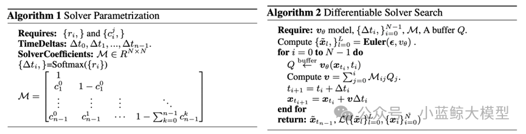

ICML（International Conference on Machine Learning，简称ICML）是机器学习与人工智能领域的国际顶级学术会议，是机器学习领域历史最悠久的、规模最大、影响最广的顶级学术会议之一，也是中国计算机学会CCF推荐的A类会议。

南京大学计算机学院大模型中心有4篇论文被ICML 2025录用。

### 01 · On the Tension between Byzantine Robustness and No-Attack Accuracy in Distributed Learning

**作者：** Yi-Rui Yang（杨亦锐）, Chang-Wei Shi（史长伟）, Wu-Jun Li（李武军）

**单位：** 南京大学

**链接：** https://cs.nju.edu.cn/lwj/paper/ICML2025_NFLinBRDL.pdf

**论文简介：**

分布式机器学习是人工智能大模型和大数据分析的核心支撑技术，近年来已经成为学术界和工业界广泛关注的热门课题。分布式机器学习的目的是利用多个相互连接的设备（节点）的算力以及存储的数据训练一个机器学习模型。传统的分布式机器学习方法往往假设工作节点不会出现故障或受到恶意攻击。近年来，随着训练数据规模和机器学习模型（大模型）规模不断增大，所需要的计算集群规模也在不断增大。相比小规模集群，大规模集群出现各类软硬件故障的概率显著增大，例如，据Meta发布的训练LLaMa 3.1的技术文档报道，在包含16384块GPU的集群上训练LLaMa 3.1 405B模型，平均每3小时会出现一次意外故障，其中78%的意外故障已确认或怀疑是硬件故障。另一方面，相比基于数据中心集群的分布式机器学习，在联邦学习等基于开放网络的分布式机器学习中，节点受到各类恶意攻击的可能性显著增加。出现故障或者受到恶意攻击的节点被称为拜占庭（Byzantine）节点。大部分已有的分布式机器学习方法在设备出现故障或受到恶意攻击时会失效。在设备出现故障或受到恶意攻击时仍然能正常工作的分布式机器学习称为拜占庭鲁棒的分布式机器学习。近年来，拜占庭鲁棒的分布式机器学习受到了越来越多的关注。现有的拜占庭鲁棒的分布式机器学习方法普遍采用鲁棒聚合器以抵御拜占庭节点的攻击（故障）。然而在实际应用中，拜占庭节点并非始终存在。据我们所知，目前尚无理论研究探讨无拜占庭节点时使用鲁棒聚合器的影响。针对这一问题，我们从理论上分析了无拜占庭攻击（故障）场景下鲁棒聚合器的聚合误差。我们证明了，当实际并不存在拜占庭节点时，鲁棒聚合器的最大聚合误差与其可容忍的拜占庭节点数量正相关。该理论结果揭示了拜占庭鲁棒性与无故障（攻击）准确度之间的内在矛盾。进一步地，我们分别针对非凸目标函数和满足Polyak-Łojasiewicz （PL）条件的目标函数，给出了采用鲁棒聚合器的梯度下降法的收敛速率下界，并证明了该下界的紧致性。该收敛速率下界同样反映出拜占庭鲁棒性与无故障（攻击）准确率之间的内在矛盾。实验数据进一步验证了我们的理论发现。该研究为实际应用中的分布式机器学习（尤其是大模型分布式训练）提供了理论指导和工程调优方向。例如，在基于大规模集群训练大模型时，在训练到达收敛点（最优值）前的大量迭代（epoch）中，可以采用拜占庭鲁棒的学习算法（鲁棒聚合器），从而避免因设备出现故障而导致训练过程的崩溃和反复重启，提升训练过程的精度和效率；在训练接近收敛点（最优值）时的极少量迭代（epoch）中，在确保集群中没有故障的前提下，切换到非拜占庭鲁棒的学习算法（如常用的平均聚合器），进一步提升精度；整个过程可以实现在保证精度的前提下，提升大模型训练速度，降低训练成本。本文被ICML 2025录用为Spotlight（所有投稿论文的2.6%，所有录用论文的9.6%）。

### 02 · Stochastic Layer-Wise Shuffle for Improving Vision Mamba Training

**作者：** Zizheng Huang, Haoxing Chen, Jiaqi Li, Jun Lan, Huijia Zhu, Weiqiang Wang, Limin Wang

**单位：** 南京大学，上海创智学院，中国移动研究院，上海人工智能实验室

**链接：** https://arxiv.org/abs/2408.17081

**论文简介：**

Vision Mamba（Vim）模型因其近线性计算复杂度在视觉数据处理中展现出巨大潜力，尤其会提升高分辨率图像和长视频的处理效率，但其训练方法，特别是大规模模型的训练，常因过拟合、训练流程复杂等问题而受限，在标准视觉基准上的性能与领先视觉Transformer（ViT）模型也存在明显差距。为了改善Vim的训练流程，本文提出了一种新颖的即插即用正则化方法——随机分层打乱（Stochastic Layer-Wise Shuffle, SLWS）。该方法的核心思想是，在训练过程中对每层的输入令牌（token）序列进行随机打乱，且对于模型各层的输入序列打乱的概率随网络深度线性增加，最后在输出时恢复为原序列顺序。如此一来，训练能够促使深层网络学习到具有位置不变性的高阶语义信息，而浅层网络则保留对低阶信息的位置敏感性，而且序列的打乱操作增加了模型对于输入数据预测的难度，从而可以缓解过拟合问题。SLWS作为一种训练正则化方式，无需修改模型架构，且在推理阶段不再被激活从而不产生任何额外开销。该方法促使模型深层和浅层具有不同的感知先验，实验证明，其不仅有效缓解了Vim模型的过拟合问题，成功支持了原先可能会崩溃的大模型进行稳定训练，在朴素监督学习范式下为不同规模的Vim模型带来明显性能提升。此外，当SLWS以CLIP模型特征作为监督信号进行掩码特征蒸馏预训练时，所得到的Vim-Huge模型在ImageNet-1K上取得了87.6%的微调准确率，为Vision Mamba模型在该基准的训练中树立了新的SOTA。

### 03 · Elucidating the Design Space of Multimodal Protein Language Models（ICML spotlight）

作者：Xinyou Wang* （王辛有）, Cheng-Yen Hsieh*, Daiheng Zhang（张代恒）, Dongyu Xue （薛东雨）, Fei Ye（叶菲）, Shujian Huang（黄书剑）, Zaixiang Zheng （郑在翔）, Quanquan Gu（顾全全）

单位：南京大学，罗格斯大学，字节跳动

链接：https://arxiv.org/abs/2504.11454

论文简介：

背景：蛋白质是由氨基酸序列折叠成特定空间结构的生物大分子，基于 AI 助力蛋白质建模与设计是当前 AI for Science 中的最重要的研究方向之一。2024 年的诺贝尔化学奖颁发给了 DeepMind 的 AlphaFold，该成果基于 AI 解决了结构生物学中困扰了 50 年的蛋白质折叠和结构预测问题，逐渐应用于药物设计（如抗体开发）、酶工程和疾病治疗等场景中。蛋白质氨基酸序列与自然语言的数据形式具有内在的相似性。受此启发，南京大学自然语言处理组与字节跳动 ByteDance Research 紧密合作，近年来在基于生成式AI的蛋白质建模与生成中持续探索，相关系列工作 DPLM（一种通用的扩散蛋白质语言模型）和 DPLM-2（多模态的蛋白质基座模型）已分别发表在ICML 2024 和 ICLR 2025，本文是该系列工作的最新进展。代码开源地址：https://github.com/bytedance/dplm，项目主页：https://bytedance.github.io/dplm/。

多模态蛋白质语言模型（Multimodal PLM）能够同时建模和生成蛋白质的结构和序列，为广泛的蛋白质设计任务奠定了坚实基础。蛋白质的序列由氨基酸 token 组成，在我们的前期工作 DPLM 中，我们采用 discrete diffusion 的建模方式，并取得了良好的效果。 蛋白质的结构信息是以坐标形式表示的连续数据类型，建模时需要将其离散化成结构 token，再与序列信息联合。我们认为现有多模态蛋白质语言模型的结构建模存在三个重要的挑战：1）对连续坐标的离散化会引入信息损失，从而导致蛋白质结构的细粒度信息丢失；2）离散的结构 token 无法准确体现局部结构特征的内在关联，对预测的准确度带来较大的挑战；3）缺少蛋白质结构的几何关系建模，导致难以准确捕捉残基在三维空间中复杂的交互关系。

为此，我们针对性提出了解决方案： 1）采用更精确的针对蛋白结构的生成式建模方式，提升了结构预测的准确度。2）利用显式的蛋白质结构的几何信号监督，通过引入几何模块和表征对齐，提升了蛋白质结构的几何关系建模能力。实验结果显示，本文提出的技术方案显著提升了多模态蛋白质语言模型的结构生成表现，对于蛋白质折叠任务的RMSD（结构预测误差指标）从 5.52 降低至 2.36 ，与专门的蛋白质折叠模型 ESMFold 持平；在无条件蛋白质生成中，采样多样性提升约30%，改善了之前采样多样性较差的问题，同时保证采样蛋白的质量。

### 04 · Differentiable Solver Search for Fast Diffusion Sampling

作者：Shuai Wang（王帅）Zexian Li（李泽贤） Qipeng Zhang（张启鹏）Tianhui Song（宋天慧）Xubin Li（李旭斌）Tiezheng Ge（葛铁铮）Bo Zheng（郑波） Limin Wan（王利民）

单位：南京大学，阿里

链接：https://arxiv.org/abs/2505.21114

论文简介：

扩散模型在生成质量上表现卓越，但这一优势的背后是大量的模型推理成本。近年来，基于常微分方程（ODE）的高级求解器应运而生，其核心目标是在有限采样步骤下，降低反向扩散求解过程中的巨额计算开销。不过，这类求解器受类Adams线性多步法的启发较深，仅依赖于与时间相关的拉格朗日插值。研究发现，与时间相关的拉格朗日插值并非扩散模型的最优选择，我们由此揭示出一个包含时间步长与求解器系数的紧凑搜索空间。基于这一分析，我们提出了一种新颖的可微分求解器搜索算法，旨在筛选出更优的求解器。实验表明，配备该搜索所得求解器后，FlowMatching模型（如SiT-XL/2和FlowDCN-XL/2）在ImageNet-256×256数据集上仅需10步，便分别取得2.40和2.35的FID分数；与此同时，DDPM模型DiT-XL/2在同样10步的条件下，FID分数达到2.33。值得关注的是，我们所搜索到的求解器性能显著优于传统求解器（甚至部分蒸馏方法），且在不同模型架构、分辨率及模型规模下均展现出良好的通用性。

