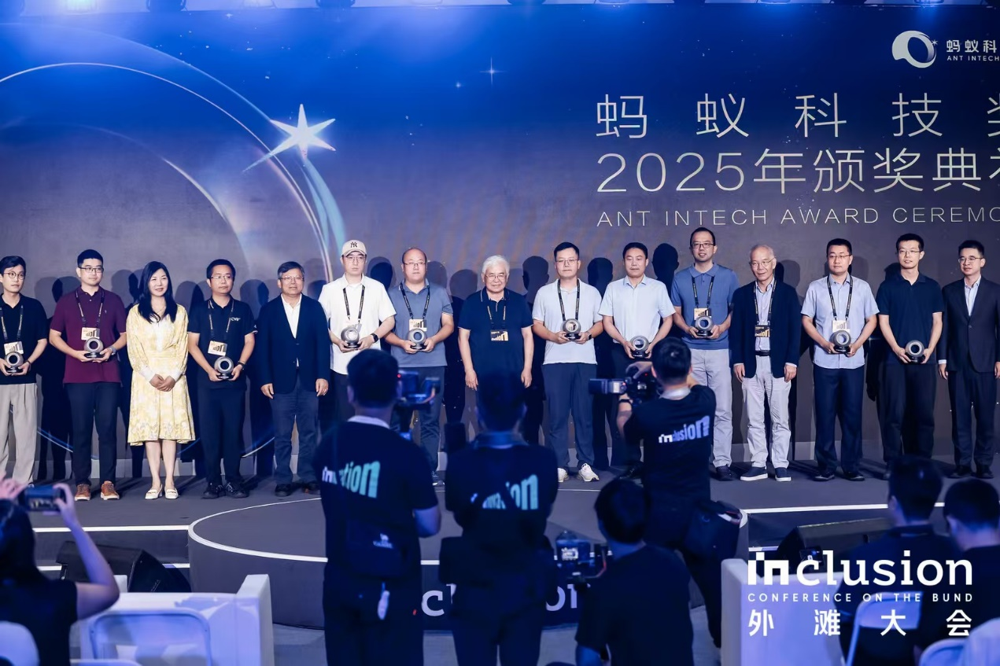
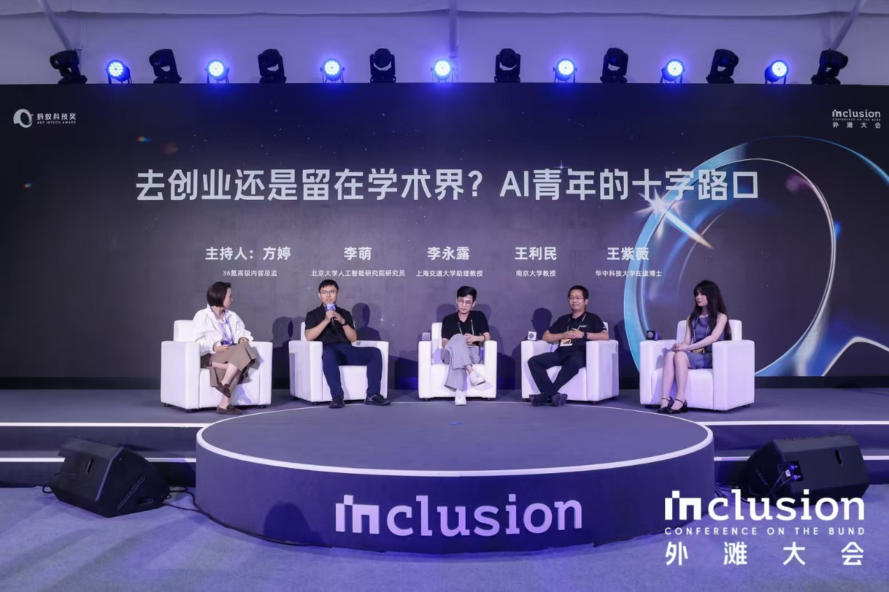

近日，在2025 Inclusion外滩大会上，"2025蚂蚁Intech奖"正式揭晓。10位青年科学家获"蚂蚁Intech科技奖"。同时，10位来自全球顶尖学府的中国籍在读博士生获"蚂蚁Intech奖学金"。其中，我院王利民教授获得了2025蚂蚁Intech科技奖，我院博士生李姝萌获得了蚂蚁Intech奖学金。

2025蚂蚁Intech奖是由蚂蚁科技集团股份有限公司设立的奖项，面向计算机科学领域的优秀青年学者与在读博士生提供公益性科研资金支持，设立"蚂蚁Intech科技奖"和"蚂蚁Intech奖学金"两大核心奖项。

图：2025蚂蚁Intech科技奖颁奖

中国工程院院士、浙江大学教授陈纯，美国国家工程院外籍院士张宏江，中国工程院院士、清华大学教授郑纬民等学界权威亲临颁奖。美国科学院、工程院、艺术与科学院三院院士Michael I.Jordan，图灵奖获得者、美国国家工程院院士、美国田纳西大学电气工程和计算机科学系教授Jack Dongarra通过视频寄语青年学者："科研之路未必平坦，但你们今日探索的问题将定义未来技术与机遇。请大胆求真，你们的研究终将影响世界。"

据了解，本届获奖者在通用人工智能（AGI）、具身智能、数字医学、数据安全等前沿方向展现出卓越创新能力，成果被业界广泛采用。我院王利民教授因在通用人工智能方面的重要贡献而获奖，获奖理由：开发了首个领先通用视频理解大模型InternVideo（下载量超500万），并提出了"渐进式训练"方法，让AI像人类分层理解动态世界，赋能自动驾驶等场景。

图：王利民教授参加2025蚂蚁Intech科技奖颁奖典礼圆桌论坛

