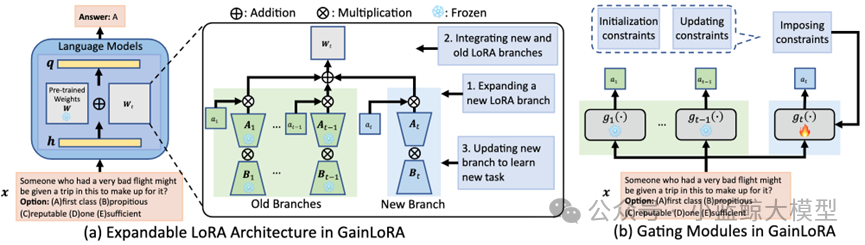
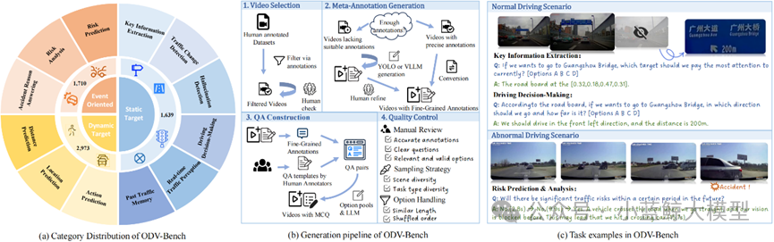
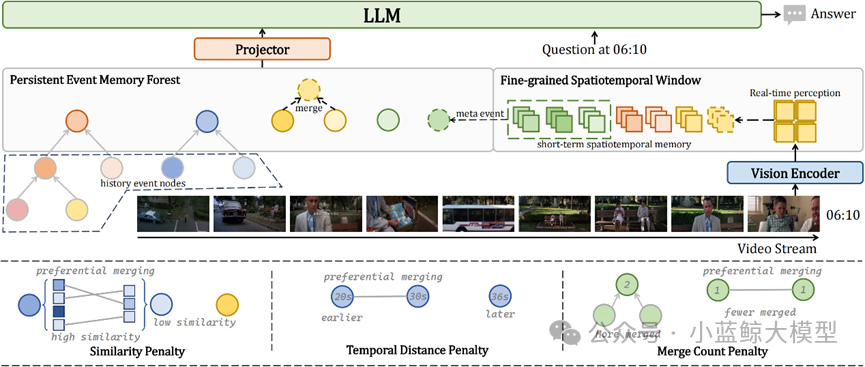
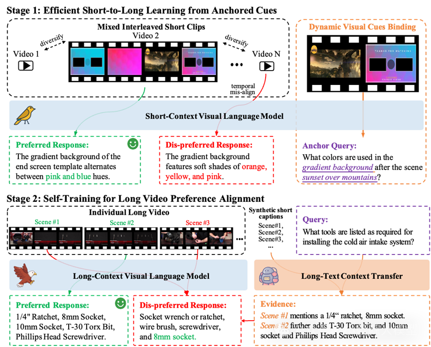
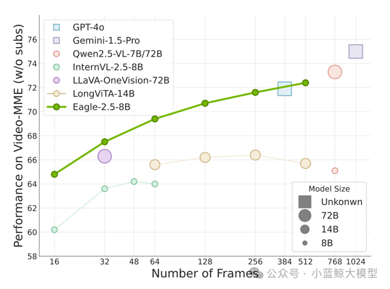
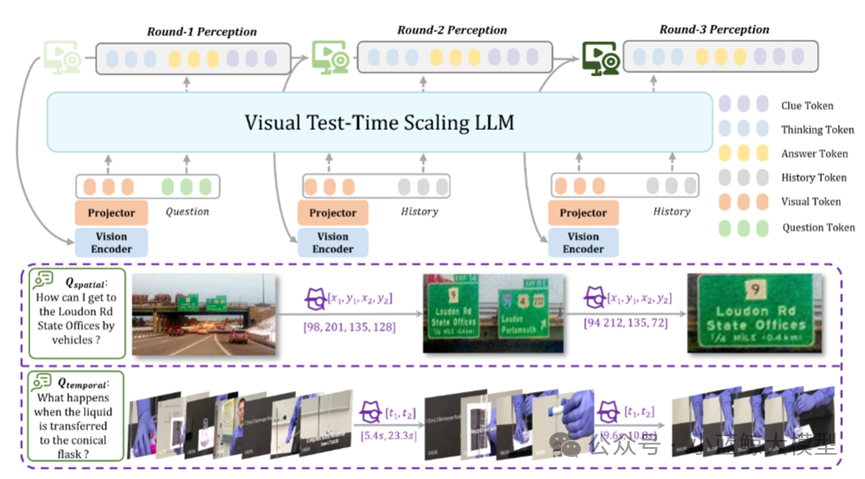
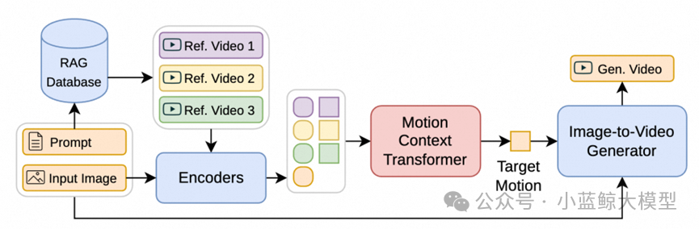
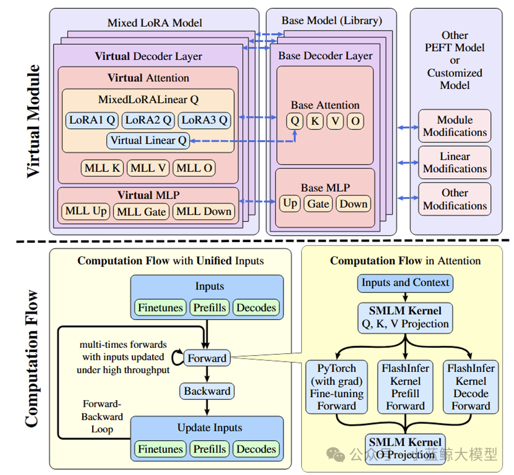
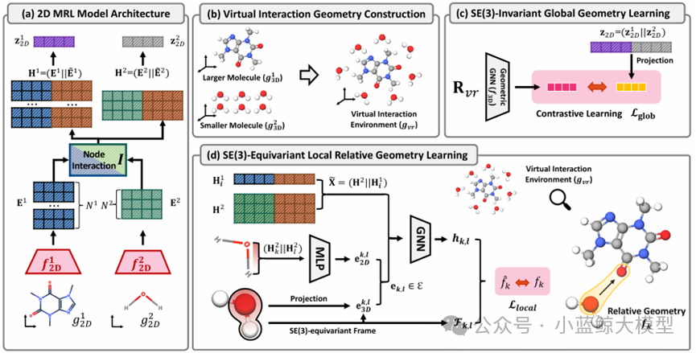
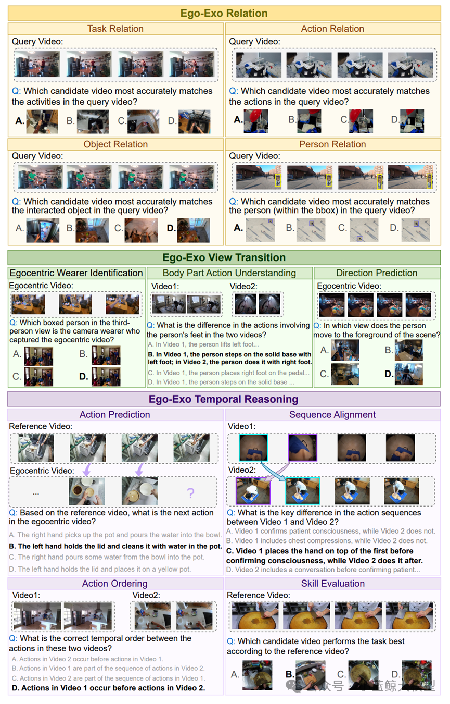

NeurIPS，全称Annual Conference on Neural Information Processing Systems，是机器学习领域的顶级会议，与ICML、ICLR并称为机器学习领域难度最大、水平最高、影响力最强的会议！NeurIPS是CCF 推荐A类会议、Core Conference Ranking推荐A类会议，H5 index高达278！NeurIPS是由连接学派神经网络的学者于1987年在加拿大创办，后来随着影响力逐步扩大，论文的主题主要以机器学习，人工智能和统计学为主。

南京大学计算机学院大模型中心有9篇论文被NeurIPS 2025录用

---

### 01

**题目**: <a href="https://arxiv.org/pdf/2505.15424" target="_blank">Gated Integration of Low-Rank Adaptation for Continual Learning of Large Language Models</a>

**作者**: Yan-Shuo Liang（梁宴硕），Jia-Rui Chen（陈嘉瑞），Wu-Jun Li（李武军）

**单位**: 南京大学

**摘要**:

得益于大规模预训练所获得的丰富知识以及后续的精调策略，现有的大语言模型（LLMs）已经在广泛的任务上展现出卓越的性能。然而，当大语言模型按顺序学习多个下游任务时，往往会遗忘已学知识，导致旧任务性能显著下降，这一现象被称为灾难性遗忘。灾难性遗忘阻碍了大语言模型持续积累新知识，因此，设计能克服灾难性遗忘的持续学习方法至关重要。另一方面，低秩适应（LoRA）作为参数高效精调中最具代表性的方法之一，在大语言模型的持续学习中受到了广泛关注。
LoRA 通过将预训练权重重新参数化为低秩形式，仅需更新少量参数即可完成任务适配，相比全量参数更新，LoRA大幅提升了精调效率。然而，现有的基于LoRA的持续学习方法仍存在不足。它们通常在学习新任务时扩展新的LoRA分支并冻结旧分支，从而避免直接修改旧参数带来的遗忘。在推理过程中，这些方法通常采用简单加法来整合新旧分支。这种方式强制新旧分支在旧任务上贡献相等，反而可能导致新分支对旧任务产生较大干扰，加剧遗忘并降低整体性能。为此，本文提出了一种新的大语言模型持续学习方法GainLoRA（gated integration of low-rank adaptation）。GainLoRA 在每个新任务上扩展新的LoRA分支，并通过引入门控模块动态整合新旧分支。通过对新的门控模块施加初始化约束和更新约束，GainLoRA 显著降低了新LoRA分支对旧任务的干扰，有效缓解遗忘并提升大语言模型在持续学习中的整体性能。

图1

---

### 02

**题目**: StreamForest: Efficient Online Video Understanding with Persistent Event Memory

**作者**: Xiangyu Zeng (曾祥宇), Kefan Qiu (裘克凡), Qingyu Zhang (张庆宇), Xinhao Li  (李新浩), Jing Wang (王婧), Jiaxin Li (李嘉辛), Ziang Yan (晏子昂), Kun Tian (田鲲),  Meng Tian (田猛), Xinhai Zhao (赵鑫海), Yi Wang (王毅), Limin Wang (王利民)

**单位**: 南京大学，上海人工智能实验室，浙江大学，华为诺亚实验室，Yinwang智能科技

**摘要**:

多模态大型语言模型近年来在视频理解领域取得了显著进展。然而，由于历史视觉特征的存储限制和实时时空推理能力的不足，它们在实时流媒体场景中的有效性仍然有限。为了应对这些挑战，我们提出了 StreamForest，这是一种专为流媒体视频理解而设计的全新架构。StreamForest 的核心是持久事件记忆森林 (Persistent Event Memory Forest)，这是一种记忆机制，可以自适应地将视频帧组织成多个事件级树状结构。该过程由基于时间距离、内容相似性和合并频率的惩罚函数引导，能够在有限的计算资源下实现高效的长期记忆保留。为了增强实时感知，我们引入了细粒度时空窗口 (Fine-grained Spatiotemporal Window)，它可以捕捉详细的短期视觉线索，从而改善当前场景的感知。此外，我们还提出了 OnlineIT，这是一个专为流媒体视频任务定制的指令调优数据集。OnlineIT 显著提升了 MLLM 在实时感知和未来预测方面的性能。为了评估其在实际应用中的泛化能力，我们引入了 ODV-Bench，这是一个专注于自动驾驶场景中实时流视频理解的全新基准测试。实验结果表明，StreamForest 达到了最佳性能，在 StreamingBench 上的准确率达到 77.3%，在 OVBench 上的准确率达到 60.5%，在 OVO-Bench 上的准确率达到 55.6%。尤其值得一提的是，即使在极端的视觉token压缩（限制为 1024 个token）下，该模型在八个基准测试中仍保持了 96.8% 的平均准确率（相对于默认8k设置）。 这些结果强调了 StreamForest 在流视频理解方面的稳健性、效率和通用性。

图2

图3

---

### 03

**题目**: LongVPO: From Anchored Cues to Self-Reasoning for Long-Form Video Preference Optimization

**作者**: Zhenpeng Huang, Jiaqi Li, Zihan Jia, Xinhao Li, Desen Meng, Lingxue Song, Xi Chen, Liang Li, Limin Wang

**单位**: 南京大学，中国移动研究院

**摘要**:

当前视觉语言模型（VLMs）在长视频理解中表现受限：一方面依赖昂贵且稀缺的长视频标注，另一方面短上下文模型在扩展到长序列时容易忽视中间内容，并在长短任务间产生性能失衡。为此，我们提出 LongVPO —— 一种无需长视频标注的两阶段直接偏好优化框架。LongVPO 首先利用"锚定线索"从短视频片段中自动合成偏好数据，再在真实长视频上通过"自我推理"实现跨片段对齐，从而习得复杂的长程推理能力。仅依赖 16K 合成数据，LongVPO 即在 LVBench、LongVideoBench、MLVU、VideoMME 等基准上取得了优越的性能，并保持了对短视频任务的强大表现，为实现高效、可扩展的长视频理解提供了新范式。

图4

---

### 04

**题目**: Eagle 2.5: Boosting Long-Context Post-Training for Frontier Vision-Language Models

**作者**: Guo Chen, Zhiqi Li, Shihao Wang, Jindong Jiang, Yicheng Liu, Lidong  Lu, De-An Huang, Wonmin Byeon, Matthieu Le, Tuomas Rintamaki, Tyler  Poon, Max Ehrlich, Tong Lu, Limin Wang, Bryan Catanzaro, Jan Kautz,  Andrew Tao, Zhiding Yu, Guilin Liu

**单位**: 南京大学，NVIDIA，香港理工大学，Rutgers University

**摘要**:

Eagle 2.5 是一系列为长上下文多模态理解设计的前沿视觉-语言模型（VLM）。现有 VLM 多集中于短上下文任务，对长视频理解和高分辨率图像处理支持不足。Eagle 2.5 提出了一套通用训练框架，核心包含两项关键技术：Automatic Degradation Sampling (ADS) 和 Image Area Preservation (IAP)，分别用于动态分配视觉与文本输入预算和在切分时尽量保持图像完整性。此外，作者引入了 渐进式混合后训练策略，逐步扩展上下文长度，提升模型处理多样输入的稳定性。为支持训练，他们构建了新的 Eagle-Video-110K 数据集，提供故事级和片段级的双层标注，增强长视频理解能力。实验表明，Eagle 2.5 在多个长视频和图像理解基准上取得显著提升。例如，8B 参数规模的 Eagle 2.5 在 Video-MME 上以 512 帧输入达到 72.4%，性能接近 GPT-4o、Qwen2.5-VL-72B 等更大规模模型。模型在高分辨率图像理解任务中同样表现优异。综上，Eagle 2.5 通过创新的采样策略、渐进训练方法和大规模多层次数据集，实现了高效且强大的长上下文多模态理解能力，为未来高性能 VLM 的发展提供了有力方向。

图5

---

### 05

**题目**: VideoChat-R1.5: Visual Test-Time Scaling to Reinforce Multimodal Reasoning by Iterative Perception

**作者**: 晏子昂，李新浩，何逸楠，岳政融，曾祥宇，王亚立，乔宇，王利民，王毅

**单位**: 浙江大学，上海人工智能实验室，南京大学，中国科学院深圳先进技术研究院

**摘要**:

在多模态大语言模型中注入推理能力，是实现类人级感知与理解的关键。现有方法多依赖大语言模型的推理能力来分析已解析的视觉信息，却常受限于静态感知阶段。
本文提出"视觉测试时缩放"（Visual Test-Time Scaling），通过在推理过程中进行迭代感知来增强 多模态大语言模型的推理能力，通过在更新的文本预测的引导下，逐步细化对高置信度时空区域的关注，从而模仿人类的分层注意力机制。训练过程当中以强化学习配合时空监督信号，端到端优化推理路径。这些设计允许多模态大语言模型通过增加其感知计算能力来提升其性能。大量实验验证了多次感知方法在各种任务和基准测试中的有效性和泛化能力。我们新推出的 Videochat-R1.5 模型在涵盖视频对话、视频推理和时空感知的 15 多个基准测试中取得了显著的改进，与 Qwen2.5VL-3B 和 -7B 等稳健基线相比，平均提高了 5% 以上。

图6

---

### 06

**题目**: MotionRAG: Motion Retrieval-Augmented Image-to-Video Generation

**作者**: Chenhui Zhu, Yilu Wu, Shuai Wang, Gangshan Wu, Limin Wang

**单位**: 南京大学

**摘要**:

得益于扩散模型的发展，图像到视频生成技术已取得长足进步。然而，生成运动逼真的视频依然是一项艰巨的挑战。该挑战的核心在于精确建模运动的复杂性，这需要捕捉物理规律、物体交互和特定领域的运动模式，而这些先验知识难以在多样的场景间有效泛化。为此，我们提出了MotionRAG，一种检索增强生成框架。
该框架通过上下文感知运动自适应（Context-Aware Motion Adaptation, CAMA）机制，从相关参考视频中提取并迁移运动先验，以提升生成视频的运动真实感。其核心技术创新在于：(1) 检索式运动表征提取：它利用视频编码器与重采样器从检索到的参考视频中提取语义级运动特征；(2) 基于"上下文学习"的运动自适应方法：通过因果Transformer架构从检索到的多个参考视频中高效学习并将运动模式迁移至目标场景；(3) 注意力运动注入适配器：将运动特征注入预训练的视频扩散模型，从而在增强运动真实性。大量实验证明，我们的方法在多个场景和各类基座模型上均取得了显著提升，且在推理阶段仅引入了可忽略不计的计算开销。此外，其模块化的设计支持对新领域的零样本泛化——仅需更新检索数据库，无需重新训练任何模型组件。本研究通过实现运动先验的高效检索与迁移，增强了视频生成系统的核心能力，为合成具有逼真动态效果的视频提供了新的范式。

图7

---

### 07

**题目**: Loquetier: A Virtualized Multi-LoRA Framework for Unified LLM Fine-tuning and Serving

**作者**: Yuchen Zhang(张宇晨), Hanyue Du(杜瀚跃), Chun Cao(曹春), Jingwei Xu(徐经纬)

**单位**: 南京大学

**摘要**:

低秩适应（LoRA）已成为一种为大语言模型（LLMs）适配至下游任务而被广泛采用的参数高效微调（PEFT）技术。尽管此前的诸多研究探索了统一大语言模型训练与服务的策略，但针对基于LoRA的模型的统一微调与推理方面的领域仍然有待探索。本文提出了Loquetier——一个虚拟化的多LoRA框架，可在单一运行时环境中无缝集成LoRA微调与推理服务。Loquetier主要包含两个部分：(1) 虚拟化模块，用于隔离基于PEFT的模型修改，并支持在共享的单个基础模型上部署多种适配器；(2) 一个优化后的、带有融合了前向传播中微调与推理路径的内核设计的计算流，实现了高效批次处理并最小化内核调用开销。在三类任务场景的广泛实验中，Loquetier在性能与灵活性方面均显著超越现有基线：在仅推理任务中吞吐量达顶尖协同服务系统的3.0倍，在统一微调与推理任务中实现比PEFT高46.4倍的服务水平目标达成率。

图8

---

### 08

**题目**: 3D Interaction Geometric Pre-training for Molecular Relational Learning

**作者**: Namkyeong Lee, Yunhak Oh，Heewoong Noh，Gyoung S. Na，Minkai Xu，Hanchen Wang，Tianfan Fu，Chanyoung Park

**单位**: KAIST，KRICT，Stanford University，Genentech，南京大学

**摘要**:

在药物发现与材料科学中，准确预测分子间相互作用至关重要。然而，现有分子关系学习方法大多局限于使用分子的二维拓扑结构，而忽略了决定相互作用本质的三维空间几何信息，这主要是因为获取精确的三维相互作用构象成本极其高昂。为了突破这一瓶颈，本文提出了3DMRL，一个创新的三维几何预训练框架。该框架的核心在于，它不再依赖昂贵的计算来获取真实交互构象，而是通过构建一个"虚拟交互环境"来模拟分子在三维空间中的接触方式，即通过随机采样与平移旋转，将多个小分子布置在一个大分子周围。在此基础上，我们设计了双重预训练任务，引导二维模型学习此虚拟环境中的三维几何信息：其一是通过对比学习，让模型理解相互作用的全局几何结构；其二是通过一个等变网络，让模型预测分子间精细的局部相对几何关系，从而捕捉原子级别的相互作用细节。大量实验表明，3DMRL能显著提升多种主流模型在分子相互作用预测与药物-药物相互作用预测等任务上的性能，在40个任务中最高实现了24.93%的性能提升，并在分布外场景下展现出卓越的泛化能力。这项工作首次为分子关系学习领域系统性地引入了三维几何预训练，为开发更精准、更通用的AI辅助科学发现工具奠定了坚实基础。

图9

---

### 09

**题目**: EgoExoBench: A Benchmark for First- and Third-person View Video Understanding in MLLMs

**作者**: Yuping He, Yifei Huang, Guo Chen, Baoqi Pei, Jilan Xu, Tong Lu, Jiangmiao Pang

**单位**: 南京大学，上海人工智能实验室，东京大学，浙江大学，复旦大学

**摘要**:

人类智能能够在第一人称（egocentric）与第三人称（exocentric）视角之间自然地转移与整合知识，这对学习与交流至关重要。然而，当前多模态大语言模型（MLLMs）虽然在单一视角的视频理解上取得了显著进展，但尚缺乏在跨视角推理上的系统性评估。为此，本文提出了 EgoExoBench ——首个用于评估 MLLMs 在第一人称与第三人称视频理解和推理能力的基准。

EgoExoBench 基于公开数据集构建，包含 7300+ 多选题（MCQ），覆盖 11 个子任务，分为三大挑战：语义对齐（semantic alignment）、视角转换（viewpoint association）、时间推理（temporal reasoning）。任务设计涵盖从任务、动作、物体到人物层面的匹配，以及跨视角的空间对应和事件顺序推理。

研究团队对 13 个主流开源与闭源 MLLMs（如 GPT-4o、Claude 3.7 Sonnet、Qwen2.5-VL、InternVL3 等）进行了系统评估。结果显示，这些模型在单视角任务中表现良好，但在跨视角任务上表现显著下降。例如，最优的开源模型 Qwen2.5-VL-72B 在整体准确率上仅达到 47%，而人类在同样任务中的准确率超过 90%。进一步实验表明，链式思维（CoT）提示并未提升性能，甚至在部分任务上降低了准确率，显示出跨视角推理对现有模型仍是重大挑战。

综上，EgoExoBench 提供了一个系统性、可扩展的评测框架，有助于推动具备类人跨视角智能的具身智能体与人机协作系统的发展。

图10

