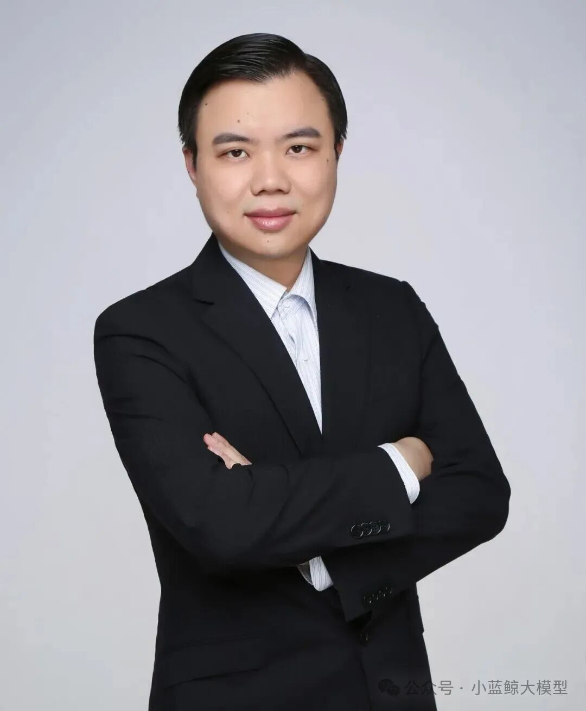

<!--  -->

**祝贺南京大学戴海鹏教授**

**当选英国工程技术学会**

**会士（IET Fellow）！**

近日，经英国工程技术学会（IET, The Institution of Engineering and Technology）遴选，南京大学戴海鹏教授当选为英国工程技术学会会士（IET Fellow）。这是本实验室在高端人才和领军人才队伍培养建设方面取得的重要突破。

<!--  -->

### IET简介

<!--  -->

英国工程技术学会是工程技术领域全球领先的专业学术学会，目前在全球150个国家拥有16.7万名会员，是欧洲规模最大、全球第二大的国际专业学会。IET Fellow是英国工程技术学会授予在科学与工程技术领域内取得重要成就的杰出高级专业人士的最高学术荣誉，每年IET遴选约200-300名IET Fellow，其中中国内地入选者约占10%。

### 戴海鹏教授简介

戴海鹏，南京大学计算机学院副教授，博导，国家级青年人才计划入选者，IET Fellow，CCF杰出会员，ACM/IEEE高级会员。获ACM中国新星奖、IEEE可扩展计算技术委员会职业中期卓越研究成就奖、中国电子学会优秀科技工作者等荣誉。研究方向为物联网、数据挖掘、移动计算等。发表国际著名会议期刊论文300余篇，含CCF A类130余篇，包括NSDI、UbiComp、INFOCOM、SIGMOD、VLDB、ICDE、KDD、WWW、EuroSys、ATC等国际一流会议。曾获一流会议期刊论文奖项十余项，包括中科协优秀科技论文、4项CCF A/B类会议最佳论文奖项等。担任国家重点研发计划项目课题负责人，主持和承担国自科面上、联合基金重点等项目十余项。荣获2024年度江苏省计算机学会科学技术奖一等奖（第一完成人），2025年度中国发明协会发明创业奖成果奖二等奖（第二完成人）。担任ACM SIGCOMM China秘书长、中国计算机学会物联网专委会常委、网络与数据通信专委会常委等职务。担任ISPA、HPCC、ICNP、COCOON等十余次会议主席职务。担任国内外一流期刊COMNET领域主编、TII编委、电子学报青年编委等职务。入选“全球前2%顶尖科学家”榜单。

戴海鹏教授当选IET Fellow，是对其在物联网、边缘计算等领域杰出贡献的重要认可，也是本实验室国际影响力和学术声誉的重要体现。我们祝贺戴教授获此殊荣，期待他在学术研究和人才培养方面取得更大成就！

<!--  -->

<a href="https://mp.weixin.qq.com/s/mluwDGxFh5vG-in8d7auMw" target="_blank">查看原文</a>
