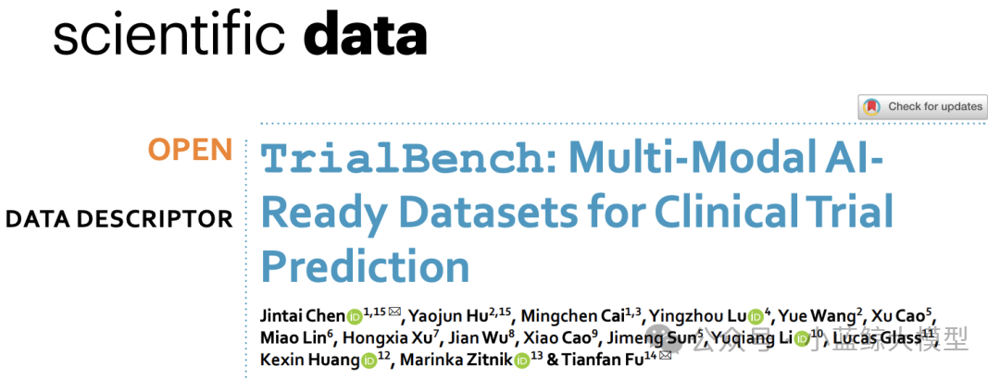
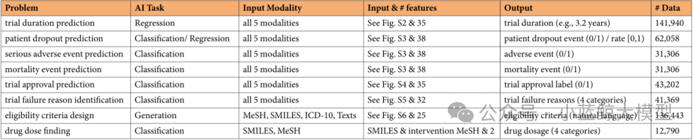
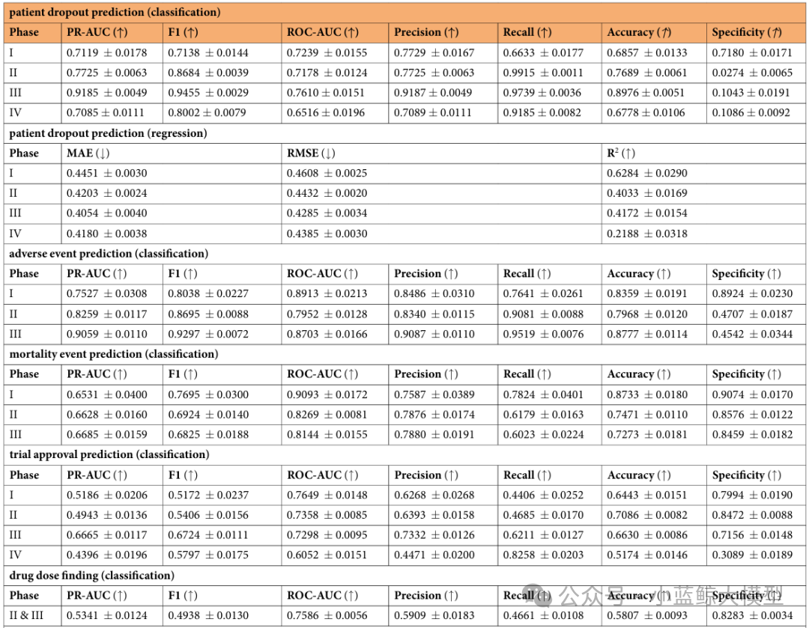
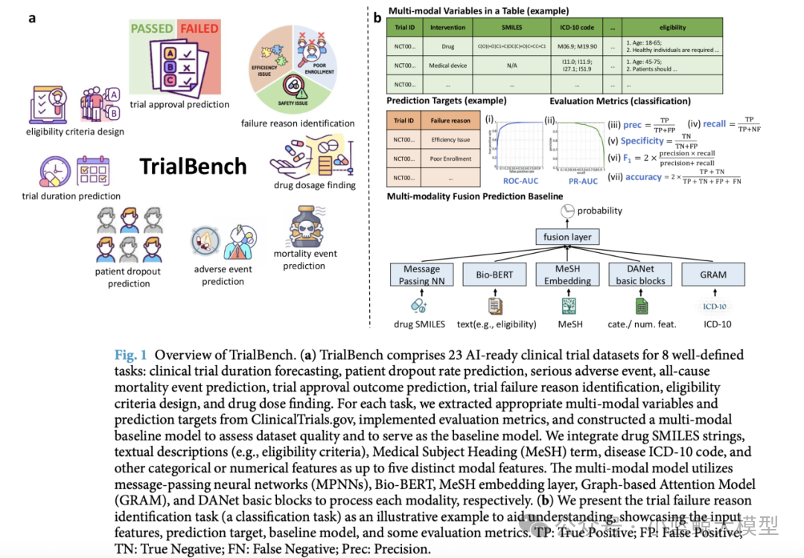

临床试验是新药从实验室走向患者的关键桥梁，但其过程充满挑战：平均成功率不足15%，耗时超过十年，成本高达数十亿美元。

2025年9月，由香港科技大学（广州）陈晋泰、南京大学符天凡、哈佛、斯坦福及临床试验公司IQVIA等团队联合开发的**TrialBench平台**在Nature子刊Scientific Data正式发表，成为全球首个**面向AI的多模态临床试验预测数据集**。

### 平台核心价值

TrialBench系统整合了23个子数据集，涵盖8大核心预测任务：

- 预测试验时长

- 预测患者退出率

- 预测严重不良事件

- 预测死亡事件

- 预测试验是否获批

- 识别失败原因

- 自动生成入选标准

- 推荐合理给药剂量

八大临床试验预测问题总结

### 技术特色

平台集成了多源数据，采用先进AI技术：

- 图神经网络处理药物分子结构

- Bio-BERT解析临床文本

- 层级注意力模型理解疾病编码

同时提供完整的基线模型、评估指标和多模态融合方法，支持Python与R语言工具包，实现“开箱即用”。

### 应用成果

实验结果显示，在14个二分类任务中，多模态模型在11个任务中F1分数超过0.7，展现出强大的预测能力。目前，**Google DeepMind**已在TxGemma模型中应用TrialBench进行不良事件预测，**AUTOCT**项目也将其作为基准评估平台。

### 开放获取

TrialBench已向全球研究者开放，旨在推动AI与医疗研究的深度融合，助力优化临床试验设计、加速新药研发进程。

平台链接：https://huyjj.github.io/Trialbench/

<a href="https://mp.weixin.qq.com/s/W67qpWpovmYYvTSF1hc6tA" target="_blank">查看原文</a>
