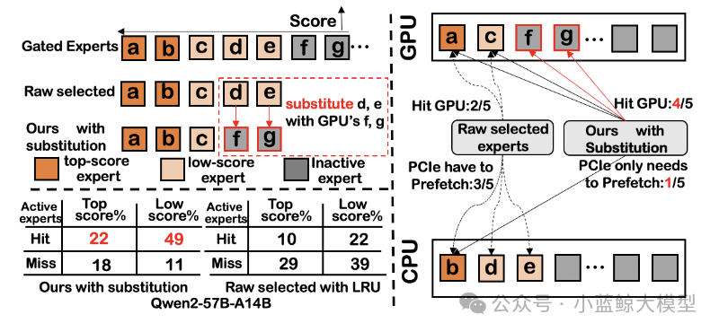
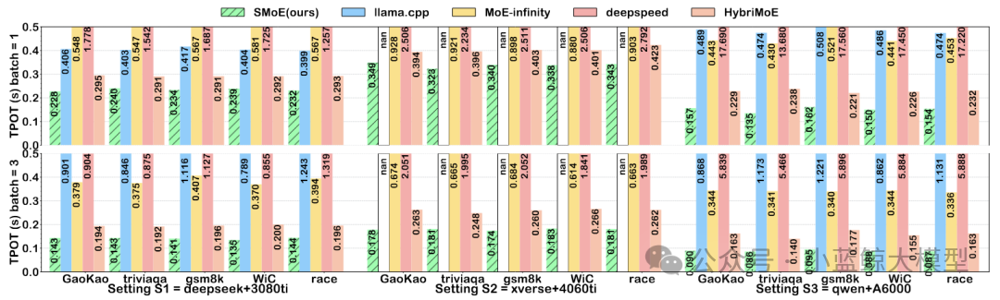

### 00 Overview

Recently, Professor Haipeng Dai's team at Nanjing University made an important breakthrough in accelerating large language model inference on edge devices. By designing a new algorithm-system co-design mechanism called Expert Substitution, the team addresses the high latency caused by dynamic offloading when deploying Mixture-of-Experts (MoE) models on edge hardware with limited GPU memory. The paper "SMoE: An Algorithm-System Co-Design for Pushing MoE to the Edge via Expert Substitution" has been accepted by the 53rd Annual International Symposium on Computer Architecture (ISCA). This is the first ISCA paper led by the Nanjing University team.

ISCA is a CCF-A conference and one of the oldest and most authoritative conferences in computer architecture. Since its first edition in 1973, it has a history of more than 50 years. The conference is jointly sponsored by ACM SIGARCH and IEEE TCCA.

### 01 Motivation

As large language models are increasingly deployed on edge devices, the MoE architecture has become a promising low-cost inference approach. However, because edge devices have limited GPU memory, they cannot hold all experts at once. During inference, systems must frequently offload some experts to slower CPU memory. Since PCIe transfer and CPU computation are 10 to 100 times slower than GPU execution, this data movement introduces severe inference latency. Through an in-depth analysis of fine-grained MoE models, the research team identifies a blind spot in existing offloading strategies: they ignore the large importance differences among activated experts. In practice, although each step activates the top-k experts, only a few experts usually receive high gating scores, while the remaining activated experts have very low scores, sometimes close to those of inactive experts.

This observation reveals a fundamental problem in current online MoE offloading mechanisms. The system spends substantial time on CPU computation and PCIe transfer merely to process low-score experts that have little effect on the final output. Designing a GPU-friendly expert scheduling mechanism that greatly reduces inference latency without harming model accuracy is therefore the central challenge.

### 02 Solution

Figure 1: The core idea of SMoE and its expert-substitution scheduling mechanism

The paper proposes SMoE from an algorithm-system co-design perspective. SMoE addresses the challenge through three coordinated mechanisms: low-score expert substitution, high-score expert prefetching, and CPU-assisted task scheduling. Its core idea is to move beyond treating offloading as a pure scheduling problem. Instead, it uses expert importance to guide decisions and directly replaces low-importance activated experts with functionally similar idle experts already cached in GPU memory, reducing memory use, data transfer, and PCIe overhead while preserving accuracy.

For low-score expert substitution, SMoE designs an expert-cache router and a history-score-based cache eviction strategy to identify low-score experts accurately and replace them with same-score idle experts in GPU memory, maximizing GPU expert cache hit rate. For high-score expert prefetching, the system loads only predicted high-score experts, reducing PCIe bandwidth pressure and enabling effective overlap between data loading and computation. For CPU-assisted computation, SMoE introduces a dynamic two-pointer scheduling algorithm to balance CPU computation and PCIe transfer time, handling experts that cannot be substituted or successfully prefetched and preventing pipeline stalls.

### 03 Results

Figure 2: TPOT comparison between SMoE and different methods across workloads

Evaluations in realistic low-batch edge inference settings show that SMoE achieves strong performance in both decoding latency (TPOT) and model accuracy. Compared with existing state-of-the-art methods, SMoE reduces average latency by 24% at batch=1 and by 35% at batch=3. In particular, on A6000 hardware, SMoE reduces decoding latency by up to 48% and maintains an expert GPU cache hit rate above 60%.

For model accuracy, extensive tests on datasets including Gaokao, MMLU, and HumanEval show that when the expert-substitution threshold is kept within a reasonable range, such as below 0.35, SMoE introduces almost negligible accuracy loss.

SMoE explores a new path from pure scheduling optimization to score-based expert substitution. This work is the team's latest research result in MLSys and offers a promising solution for efficient and nearly lossless deployment of large models on memory-constrained edge devices.

<a href="https://mp.weixin.qq.com/s/OwzZ_S3YD_yvzz8IjNYmxA" target="_blank">Read original article</a>
