ICLR (International Conference on Learning Representations) is one of the leading AI conferences focusing on deep learning and representation learning. Eleven papers from the Large Model Innovation Center at Nanjing University’s School of Computer Science were accepted at ICLR 2026.

---

### 01

**Title**: Long-Context Attention Benchmark: From Kernel Efficiency to Distributed Context Parallelism

**Authors**: Tao Bu, Qiangang Wang, Bowen Zeng, Hanwen Sun, Yunpeng Huang, Chun Cao, Jingwei Xu

**Affiliations**: Nanjing University; Peking University; Zhejiang University

**Link**: https://arxiv.org/abs/2510.17896

**Abstract**:

Transformer-based large language models have achieved remarkable success, but their softmax attention mechanism incurs quadratic computation and memory costs as sequence length grows, making it a key bottleneck for long-context training. Existing work mainly optimizes attention from two perspectives: operator-level acceleration for dense or sparse attention, and module-level distributed attention or context parallelism across devices. However, the field still lacks a systematic benchmark that comprehensively compares attention operators and clearly analyzes the performance of different context-parallel methods. This work proposes a unified benchmarking framework that integrates multiple attention operators and context-parallel mechanisms, evaluating them along two key dimensions: attention-mask patterns and the interaction between sequence length and distributed scale. Experiments on up to 96 GPUs provide reproducible comparisons, reveal trade-offs among methods, and offer practical guidance for designing and deploying attention mechanisms in long-context LLM training.

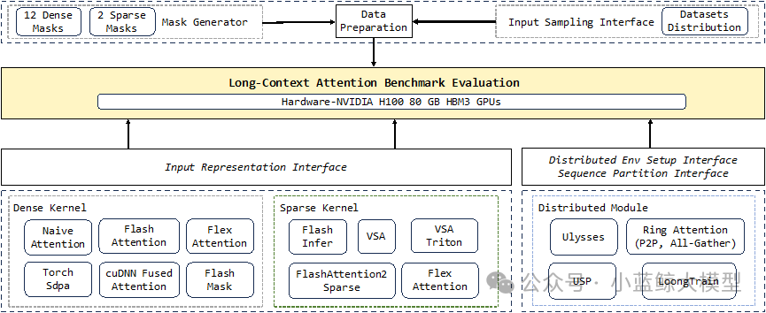

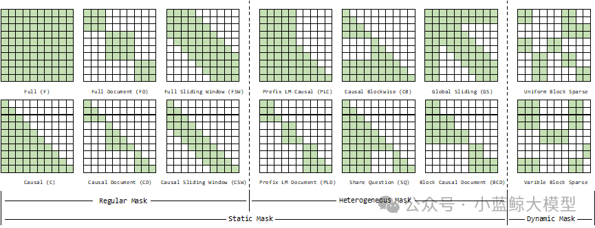

### 02

**Title**: PoseX: A Large-Scale Cross-Docking Benchmark for Real-World Protein-Ligand Docking

**Authors**: Yize Jiang, Xinze Li, Yuanyuan Zhang, Jin Han, Youjun Xu, Ayush Pandit, Zaixi Zhang, Mengdi Wang, Mengyang Wang, Chong Liu, Guang Yang, Yejin Choi, Wu-Jun Li, Tianfan Fu, Fang Wu, Junhong Liu

**Affiliations**: WecoAI; Princeton University; Nanjing University; ByteDance; Stanford University; Peking University

**Link**: https://arxiv.org/abs/2505.01700

**Abstract**:

Molecular docking is a core technique for biopharmaceutical research and industrial enzyme engineering, yet traditional methods struggle to handle dynamic protein conformations. Cross-docking has therefore become a widely recognized challenge. The field has long lacked a unified, high-quality benchmark oriented toward real-world practice, causing many algorithms that perform well in laboratory settings to fall short in practical deployment. PoseX introduces an open collaborative evaluation platform and the first large-scale benchmark dedicated to cross-docking. It contains 718 self-docking samples and 1,312 cross-docking samples, covering 24 mainstream algorithms across physics-based methods, AI docking, and AI co-folding. Rigorous evaluations show that leading AI algorithms comprehensively outperform traditional physics-based methods in cross-docking; SurfDock achieves state-of-the-art performance, with a success rate above 77% after relaxation. The benchmark also clarifies the performance gap between blind docking and pocket-specified docking, as well as the generalization behavior of AI models. PoseX fills a practical evaluation gap and provides digital infrastructure for synthetic biology, drug discovery, and enzyme engineering.

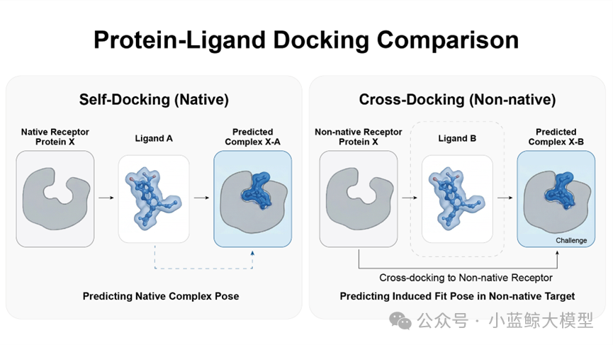

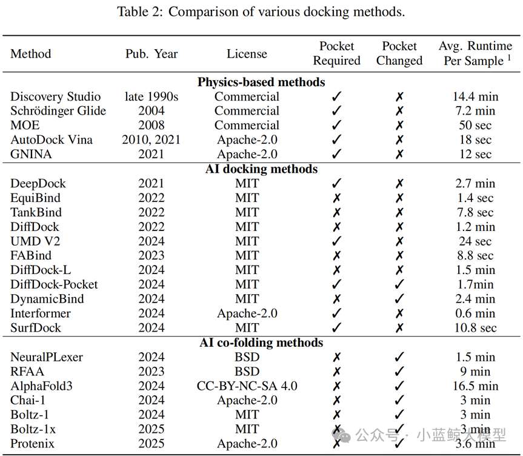

### 03

**Title**: PIXNERD: PIXEL NEURAL FIELD DIFFUSION

**Authors**: Shuai Wang, Ziteng Gao, Chenhui Zhu, Weilin Huang, Limin Wang

**Affiliations**: Nanjing University, ByteDance Seed, National University of Singapore

**Link**: https://arxiv.org/pdf/2507.23268

**Abstract**:

The strong performance of diffusion transformers often depends on compressed latent spaces produced by pretrained variational autoencoders. This two-stage paradigm inevitably introduces error accumulation and decoding artifacts. Pixel-space modeling is a promising alternative, but existing approaches often require complex cascaded pipelines and substantially increase token-level computation. Inspired by the simplicity and efficiency of latent diffusion transformers, this work proposes a pixel-space diffusion approach based on large image patches and neural-field decoding, forming a lightweight, single-stage, end-to-end solution called PixNerd. With efficient neural-field representation, PixNerd achieves an FID score of 1.93 on ImageNet at 256x256 resolution without cascaded architectures or VAEs, while reducing inference latency by nearly 8x compared with existing pixel-level diffusion models. The framework is further extended to text-to-image generation, achieving a GenEval score of 0.73 and a DPG score of 80.9.

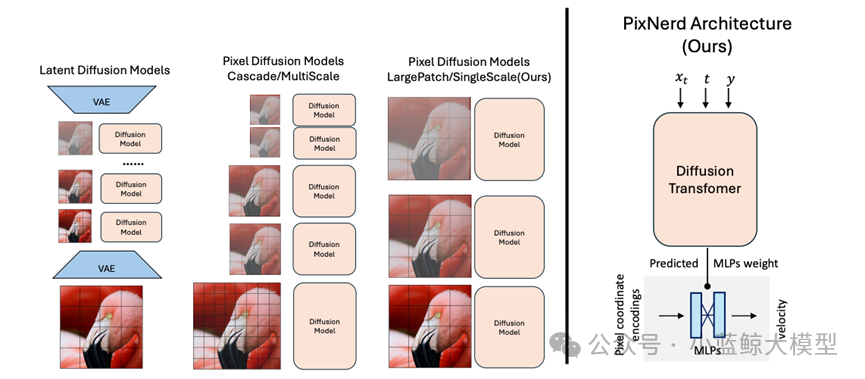

### 04

**Title**: RIVER: A Real-Time Interaction Benchmark for Video LLMs

**Authors**: Yansong Shi, Qingsong Zhao, Tianxiang Jiang, Xiangyu Zeng, Yi Wang, Limin Wang

**Affiliations**: University of Science and Technology of China, Shanghai AI Laboratory, Fudan University, Nanjing University

**Abstract**:

Video large language models have demonstrated impressive capabilities, but most operate in an offline setting, limiting their potential for real-time interaction. RIVER Bench addresses this gap by evaluating how models interact with humans through streaming multimedia inputs. The benchmark introduces three task categories: retrospective memory, real-time perception, and proactive response. Rather than following the conventional one-shot full-video understanding paradigm, it simulates interactive human dialogue. The benchmark integrates heterogeneous video sources with varying durations and fine-grained annotations to create realistic real-time interaction settings. Results show that offline models may perform well on single-turn QA but struggle in real-time scenarios. The work further proposes a general improvement strategy for limitations such as weak long-term memory and insufficient future awareness, improving flexibility and adaptability in real-time interaction.

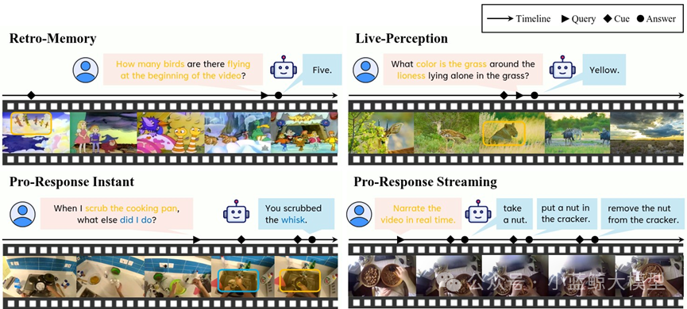

### 05

**Title**: ARBITRARY GENERATIVE VIDEO INTERPOLATION

**Authors**: Guozhen Zhang, Haiguang Wang, Chunyu Wang, Yuan Zhou, Qinglin Lu, Limin Wang

**Affiliations**: Nanjing University, Tencent Hunyuan, Shanghai AI Laboratory

**Abstract**:

Generative video frame interpolation synthesizes intermediate frames between given start and end frames and plays an important role in video creation. Existing generative VFI methods, however, are usually limited to producing a fixed number of intermediate frames, which restricts flexible control over frame rate and duration. This work proposes ArbInterp, a new generative VFI framework that supports arbitrary timestamps and arbitrary-length interpolation. To handle arbitrary timestamps, it introduces timestamp-aware rotary positional encoding, which modulates temporal RoPE positions so generated frames align with target normalized timestamps. For arbitrary-length interpolation, the method decomposes long-sequence generation into segmented frame synthesis and designs a disentangled appearance-motion conditioning strategy. Appearance consistency is maintained through previous segment boundaries, while temporal semantics preserve motion continuity across segments. Experiments on a multi-scale interpolation benchmark from 2x to 32x show that ArbInterp outperforms existing methods across settings, achieving higher fidelity and smoother spatiotemporal continuity.

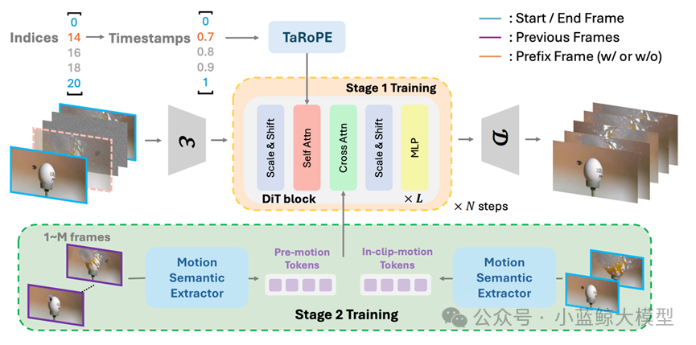

### 06

**Title**: VideoChat-Flash: Hierarchical Compression for Long-Context Video Modeling

**Authors**: Xinhao Li, Yi Wang, Jiashuo Yu, Xiangyu Zeng, Yuhan Zhu, Haian Huang, Jianfei Gao, Kunchang Li, Yinan He, Chenting Wang, Yu Qiao, Yali Wang, Limin Wang

**Affiliations**: Shanghai AI Laboratory, Nanjing University, Shenzhen Institute of Advanced Technology, Chinese Academy of Sciences

**Abstract**:

Long-context video modeling is essential for multimodal large language models, enabling them to process movies, online streams, and other long-form content. Despite recent progress, efficient understanding of extremely long video contexts remains challenging. This work provides a systematic solution across model architecture, training data, training strategy, and evaluation. It first proposes hierarchical video token compression (HiCo), which exploits visual redundancy in long videos and compresses video context from clip level to video level, retaining key information while reducing computation by approximately 50x with nearly no performance loss. It then introduces a short-to-long multi-stage learning paradigm, builds LongVid, a large-scale real-world long-video dataset, and designs a challenging multi-hop needle-in-a-video-haystack benchmark. The resulting VideoChat-Flash model achieves leading performance on both long- and short-video benchmarks at 2B and 7B scales, and reaches 99.1% accuracy on a 10,000-frame NIAH test among open-source models.

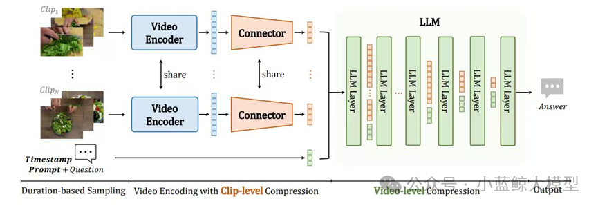

### 07

**Title**: CaReBench: A Fine-Grained Benchmark for Video Captioning and Retrieval

**Authors**: Yifan Xu, Xinhao Li, Yichun Yang, Desen Meng, Rui Huang, Limin Wang

**Affiliations**: Nanjing University, Shanghai AI Laboratory

**Abstract**:

Video captioning and video retrieval remain important challenges for video-language models. Existing benchmarks often contain only short text descriptions, making it difficult to evaluate whether models deeply understand fine-grained video details. CaReBench addresses this issue with a fine-grained benchmark for detailed video captioning and retrieval. It contains 1,000 high-quality video-description pairs, and each video is further annotated with spatial and temporal splits. Based on this design, the authors propose ReBias for retrieval and CapST for captioning, enabling systematic analysis of spatial and temporal biases in video-language models. The work also builds a unified baseline based on multimodal large language models, supporting both fine-grained video retrieval and detailed video captioning through two-stage supervised fine-tuning. Experiments show competitive performance against CLIP-style retrieval models and mainstream multimodal LLMs, suggesting the potential of unified multimodal LLM modeling for both tasks.

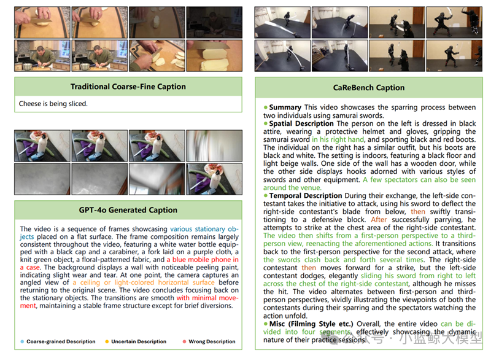

### 08

**Title**: Balancing the Experts: Unlocking LoRA-MoE for GRPO via Mechanism-Aware Rewards

**Authors**: Changlian Ma, Zizheng Huang, Xiangyu Zeng, Yi Wang, Cheng Liang, Kun Tian, Xinhai Zhao, Limin Wang

**Affiliations**: Nanjing University, Shanghai AI Laboratory, Huawei Noah’s Ark Lab, Shanghai Innovation Institute, Shanghai Jiao Tong University

**Abstract**:

Parameter-efficient mixture-of-experts architectures such as LoRA-MoE perform well in fine-tuning, but when combined with advanced reinforcement learning algorithms such as GRPO, they often suffer from severe routing collapse and insufficient parameter utilization. This work proposes RO-GRPO, a mechanism-aware reinforcement fine-tuning framework. Its core idea is to convert internal expert-routing statistics collected during training, such as routing entropy and load distribution, into direct scalar reward signals. Routing supervision is seamlessly integrated into reinforcement fine-tuning without adding extra training stages or differentiable auxiliary losses. Experiments on both unimodal and multimodal mathematical reasoning benchmarks show that RO-GRPO significantly improves task performance and expert load balancing while mitigating text degeneration. The work demonstrates that scalar rewards in GRPO can explicitly guide optimization of internal mechanisms, extending model alignment from external behavior to internal mechanism alignment.

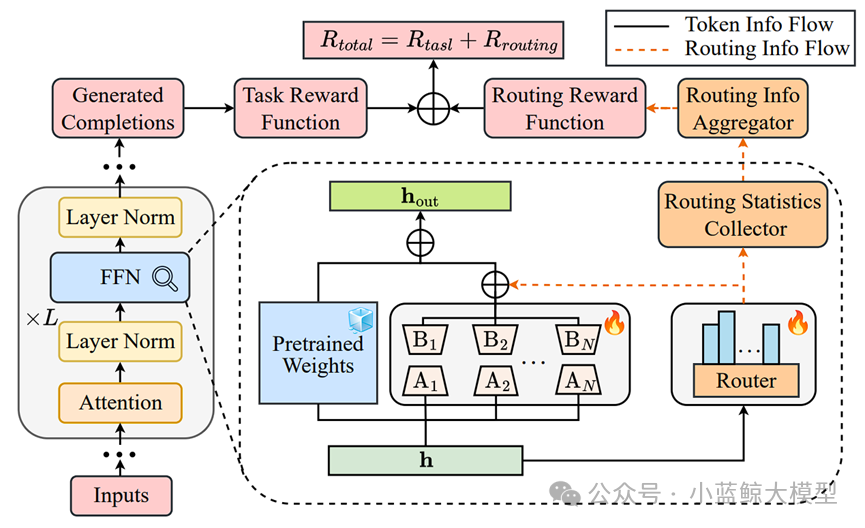

### 09

**Title**: UniFlow: A Unified Pixel Flow Tokenizer for Visual Understanding and Generation

**Authors**: Zhenrong Yue, Haiyu Zhang, Xiangyu Zeng, Boyu Chen, Chenting Wang, Shaobin Zhuang, Lu Dong, Yi Wang, Limin Wang, Yali Wang

**Affiliations**: Shanghai Jiao Tong University, Shanghai AI Laboratory, Beihang University, Shenzhen Institute of Advanced Technology, Chinese Academy of Sciences, Nanjing University, University of Science and Technology of China, University of Chinese Academy of Sciences

**Abstract**:

Tokenizers are central components for visual understanding and generation. Recent research has turned toward unified tokenizers, but existing methods face a clear trade-off between understanding and generation due to the conflict between high-level semantic abstraction and low-level pixel reconstruction. UniFlow is a unified tokenizer that flexibly adapts any visual encoder through a simple reconstruction decoder. It introduces layer-wise adaptive self-distillation to well-pretrained visual encoders, allowing UniFlow to inherit strong semantic features for understanding while adapting to fine-grained details for generation. It also proposes a lightweight patch-wise pixel flow decoder, which models the conditional flow from noise to patch pixels for efficient high-fidelity reconstruction. By using semantic features as visual conditions and simplifying the data distribution through patch-wise learning, UniFlow reduces the training conflict between understanding and generation. Extensive experiments on 13 benchmarks across seven visual understanding and generation tasks show a win-win result: UniFlow-XL 7B outperforms TokenFlow-XL 14B by about 6.05% on average understanding benchmarks while remaining competitive in reconstruction and generation, surpassing UniTok by 0.15 rFID and 0.09 gFID without guidance.

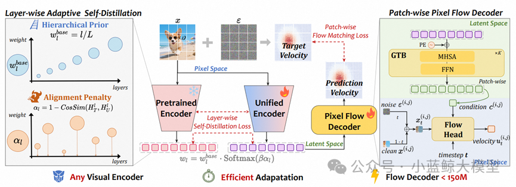

### 10

**Title**: The First Impression Problem: Internal Bias Triggers Overthinking in Reasoning Models

**Authors**: Renfei Dang, Zhening Li, Shujian Huang, Jiajun Chen

**Affiliations**: Nanjing University

**Link**: https://iclr.cc/virtual/2026/poster/10011746

**Abstract**:

Reasoning models often exhibit overthinking. This work argues that internal bias triggered by the input question is a key cause. When a model receives a user question, it forms an initial guess before systematic reasoning; because this guess is usually not explicitly output, the authors define it as internal bias. When this initial guess conflicts with later reasoning or the final answer, the model tends to fall into excessive reflection. The authors verify a significant correlation between internal bias and overthinking across multiple models and reasoning tasks. To establish causality, they design two counterfactual intervention experiments: removing the input question after the model forms an initial tendency reduces the influence of question-induced bias and redundant reasoning, while manually injecting bias changes the degree of overthinking. Interpretability experiments further show that excessive attention to the input question is a key mechanism through which internal bias affects later reasoning trajectories. The work also evaluates existing methods for reducing overthinking, finding that internal bias remains persistent across tested settings.

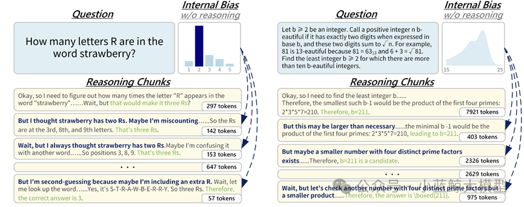

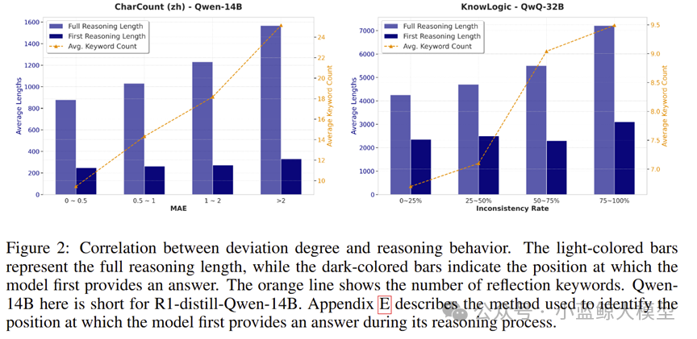

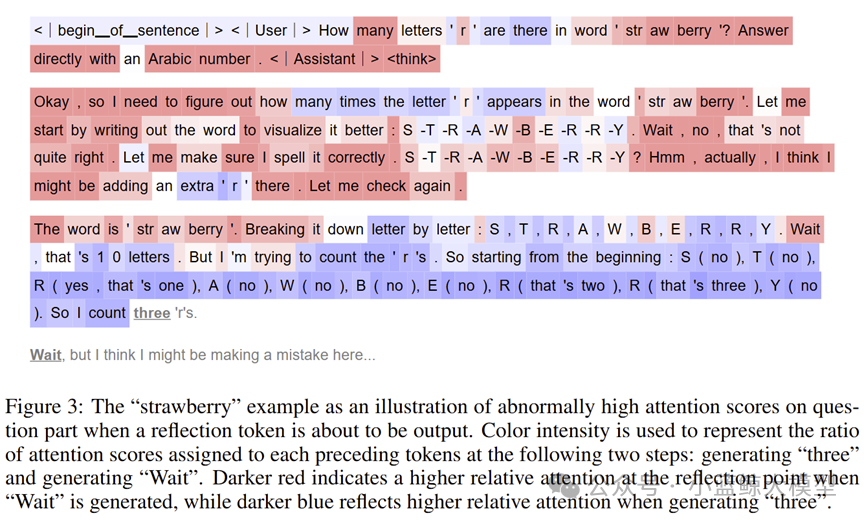

### 11

**Title**: DuPO: Enabling Reliable LLM Self-Verification via Dual Preference Optimization

**Authors**: Shuaijie She, Yu Bao, Yu Lu, Lu Xu, Tao Li, Wenhao Zhu, Jianbing Zhang, Shujian Huang, Shanbo Cheng, Lu Lu, Yuxuan Wang

**Affiliations**: Nanjing University, ByteDance Seed

**Link**: https://iclr.cc/virtual/2026/poster/10009423

**Abstract**:

Training large language models still faces a key bottleneck: reinforcement learning from human feedback relies on costly human annotation, while reinforcement learning with verifiable rewards reduces annotation needs but is limited to verifiable tasks such as math and code. Traditional dual learning provides self-supervised feedback through task duality, but its strict bidirectional invertibility requirement restricts it to a small set of symmetric tasks and is affected by asymmetry between forward and reverse capabilities. DuPO proposes a preference optimization framework based on generalized duality. It decomposes the input of the original task into known and unknown parts, and redefines the dual task as reconstructing the unknown part using the forward output and known information, thereby mitigating capability asymmetry. Experiments show that DuPO improves multiple tasks without external annotation: it raises average COMET by 2.1 points across 756 translation directions, improves accuracy by 6.4 percentage points on four challenging mathematical reasoning benchmarks, and brings a 9.3 percentage-point gain at inference time through reranking without additional fine-tuning. These results suggest a scalable, general, annotation-free path for LLM self-improvement.

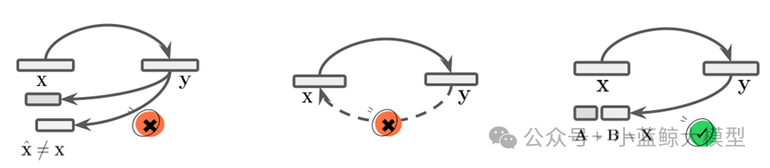

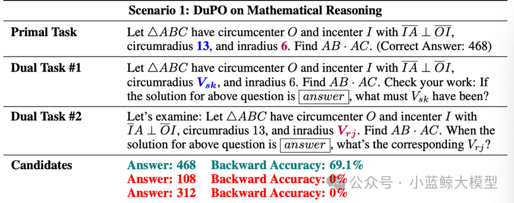

<a href="https://mp.weixin.qq.com/s/ozDhu4ZsXhnIJDHbfvXN8Q" target="_blank">View original</a>
