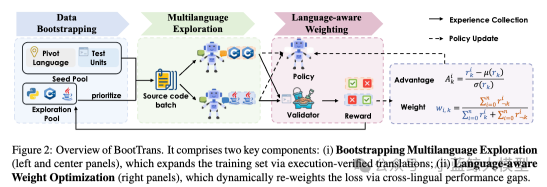

ACL（Annual Meeting of the Association for Computational Linguistics，简称 ACL）是自然语言处理与计算语言学领域的国际顶级学术会议之一，由国际计算语言学协会主办，每年举办一次，长期汇聚全球高校、科研机构和产业界在语言理解、机器翻译、信息抽取、对话系统、大语言模型、多模态语言智能等方向的前沿研究成果。ACL 是中国计算机学会 CCF 推荐的人工智能领域 A 类国际学术会议，与 EMNLP、NAACL 等共同构成自然语言处理领域最具影响力的会议体系，其中 ACL 通常被视为该领域的旗舰会议。根据 Google Scholar Metrics 2025 最新发布的全球学术期刊和会议影响力排名，ACL 在 Computational Linguistics 类别中位列第 1。

南京大学计算机学院大模型中心有9篇论文被ACL 2026录用，其中ACL Main 共计5篇、Findings of ACL 共计4篇。

### 01

**ACL分类**：ACL Main

**题目**：Bootstrapping Code Translation with Weighted Multilanguage Exploration

**作者**：Yuhan Wu, Huan Zhang, Wei Cheng, Chen Shen, Jingyue Yang, Wei Hu

**单位**：南京大学

**链接**：https://arxiv.org/abs/2601.03512

**论文简介**：

BootTrans是一项面向多语言代码翻译任务的研究工作，旨在缓解现有方法对高质量平行语料和可执行测试数据的依赖问题。针对多语言代码翻译中平行验证数据稀缺、不同语言对翻译难度不均衡以及模型容易偏向简单翻译路径等问题，作者提出了一种无需平行语料的自举式代码翻译框架 BootTrans。该方法利用单元测试在不同编程语言间的可迁移性，构建双数据池驱动的循环训练机制，通过动态收集模型在 Rollout 过程中成功生成的翻译样本，进一步扩展反向翻译和跨语言翻译路径，从而突破传统枢纽语言限制。同时，BootTrans 引入语言感知的动态加权优化策略，根据不同翻译方向的难度自适应调整训练权重，使模型能够更加关注复杂或低性能的目标语言方向。实验结果表明，BootTrans 在 HumanEval-X 和 TransCoder-Test 等基准数据集上均显著优于基座模型及现有代码翻译微调方法，并在 Llama-3.1-8B 上取得最高 16.57% 的性能提升。此外，该方法在未见语言、低资源语言以及更复杂的类级别代码翻译任务中也表现出良好的泛化能力和鲁棒性，说明其为提升全向多语言代码翻译能力提供了一种有效思路。

### 02

**ACL分类**：ACL Main

**题目**：AEA: Adaptive Expert Allocation Improves Sentence Embeddings from Mixture-of-Experts LLM

**作者**：Shufan Yang（杨书璠）, Zifeng Cheng（程紫峰）, Zhiwei Jiang（蒋智威）, Qingfeng Qi（祁青峰）, Yafeng Yin（殷亚凤）, Cong Wang（王聪）, Ao Zhou（周翱）, Qing Gu（顾庆）

**单位**：南京大学

**论文简介**：

直接从混合专家模型中提取句子嵌入是一个很有前景但尚未充分探索的方向，它无需额外的数据或微调。虽然以往的研究利用语义压缩提示或专家路由信息来改进句子嵌入，但它们通常会在所有层和词元上均匀分配固定数量的专家，忽略了层间和词元间的异质性。本文中，我们识别出混合专家模型中的两个关键现象：（1）专家同质性的层级差异，表明不同层需要不同的专家预算；（2）词元贡献不平衡，表明不同的词元也应该分配不同数量的专家。为了解决这些问题，我们提出了一种自适应专家分配（AEA）框架，该框架动态地执行层级分配和词元级专家分配，以提高词嵌入质量。具体而言，AEA 将较少的专家分配给同质性较高的层以及注意力重要性较低的词元，其中层级同质性由各层专家生成的嵌入之间的相似性决定。值得注意的是，我们的方法即插即用，可与现有的提示工程方法无缝集成，且不会引入额外的时间开销。在 STS 任务上的实验表明，AEA 在多个 MoE 模型中均能持续提升词嵌入质量。

### 03

**ACL分类**：ACL Main

**题目**：Focusing Condition: Inference-Time Self-Contrastive Steering Elicits Better Conditional Text Embeddings in LLMs

**作者**：Zifeng Cheng（程紫峰）, Lingyun Qian（钱凌云）,  Zhiwei Jiang（蒋智威）, Cong Wang（王聪）, Yafeng Yin（殷亚凤）, Fei Shen（沈飞）, Ao Zhou（周翱）, Qing Gu（顾庆）

**单位**：南京大学  新加坡国立大学

**论文简介**：

从大型语言模型（LLMs）中直接提取出条件文本嵌入由于其无需额外数据和微调，受到了广泛的关注。现有方法通过在提示词中加入条件来引导大型语言模型关注特定的条件，从而生成条件文本嵌入。然而，仅依赖提示词往往无法产生高质量的条件文本嵌入，因为这些嵌入仍与通用文本嵌入相互交织，最终导致其质量下降。为此，我们提出了一种即插即用的推断时自对比引导（SCS）方法，该方法通过构建无条件的通用文本嵌入来优化条件文本嵌入，使其更聚焦于目标条件。具体而言，我们通过修改注意力掩码和位置编码来屏蔽条件，从而获得无条件文本嵌入，并干预多头自注意力计算过程。值得注意的是，我们的方法效率极高，仅需在推理时额外进行一次多头自注意力计算。针对聚类、语义文本相似度及三元组对齐数据集的大规模实验表明，我们的方法能够以无需训练且即插即用的方式，无缝提升不同大型语言模型上现有提示式方法的性能。

### 04

**ACL分类**：ACL Main

**题目**：A Data-Efficient Path to Multilingual LLMs: Language Expansion via Post-training PARAM∆ Integration into Upcycled MoE

**作者**：Hao Zhou(周昊), Tianhao Li(李天昊), Zhijun Wang(王志军), Shuaijie She(佘帅杰), Linjuan Wu(吴林娟), Hao-ran Wei(魏浩然), Baosong Yang(杨宝嵩), Jiajun Chen(陈家骏), Shujian Huang(黄书剑)

**单位**：南京大学  通义实验室  浙江大学

**论文简介**：

当前大语言模型的多语言能力以英文(中文)为主,低资源语言能力较差。传统语言扩展方法中会首先会在继续预训练阶段使用大规模单语数据为为模型补充目标语言基础知识，其次进行后训练帮助模型与人类偏好对齐。然而，受限于后训练阶段需要大量目标语言高质量标注数据，很多工作尝试将后训练过程通过参数融合来取代，从而绕过数据瓶颈。但这些方法仍面临一个核心矛盾：继续预训练（CPT）得到的参数与后训练得到的参数之间存在冲突。为了解决参数冲突问题，我们提出了DeltaMoE的方法，通过扩展多个专家，并将每个专家叠加后训练参数的差值，从而帮助MoE模型获得对齐能力。实验结果显示，DelaMoE在参数相同以及训练FLOPs匹配的条件下，均在扩展语言上相比baseline提升显著，同时能显著保留原始语言的知识，避免灾难性遗忘。

### 05

**ACL分类**：ACL Main

**题目**：Reasoning While Asking: Transforming Reasoning Large Language Models from Passive Solvers to Proactive Inquirers

**作者**：Xin Chen(陈鑫), Feng Jiang(蒋峰), Yiqian Zhang(张宜千), Hardy Chen (陈桂铭), Shuo Yan(严硕), Wenya Xie(谢文雅), Min Yang(杨敏), Shujian Huang(黄书剑)

**单位**：南京大学  深圳理工大学人工智能研究院  中国科学院深圳先进技术研究院

**链接**：https://arxiv.org/abs/2601.22139

**论文简介**：

面向推理的大语言模型，如 DeepSeek-R1，依托显式推理轨迹在复杂任务上取得了显著进展。然而，这类模型仍受限于一种“盲目自我思考”（Blind Self-Thinking）范式：当用户指令存在前提缺失或意图模糊时，模型往往仍会进行冗长的内部推理，进而导致过度思考、幻觉以及结论偏离用户真实意图，损害交互效率与用户体验。为解决这一问题，我们提出主动交互式推理（Proactive Interactive Reasoning, PIR）新范式，旨在将推理型大语言模型从被动求解者转变为主动询问者，使模型能够在推理过程中交错执行“思考—提问—反馈”，并通过澄清关键不确定性来更准确地对齐用户意图。

PIR 框架由两个阶段构成：（1）交互能力激活阶段，提出基于不确定性感知的数据增强机制，定位推理过程中不确定性的关键决策点，并在这些位置注入澄清问题与模拟用户回复，将单调推理轨迹转化为“思考–提问–反馈”的交互格式，通过监督微调赋予模型主动提问能力；（2）用户意图对齐阶段，构造基于用户模拟器的群体相对策略优化框架（US-GRPO），结合任务正确性的外在奖励与模型提问的“帮助性–效率”双维度的内在奖励，引导模型在准确求解的同时减少不必要的交互。在数学推理、代码生成和文档编辑三类多轮交互任务上的实验结果表明，PIR 相较于多种基线取得了稳定提升，并显著降低了推理计算量与冗余交互轮次。进一步在 MMLU、MMLU-Pro、TriviaQA、SQuAD 以及 Missing Premise 测试等非交互式基准上的评估表明，PIR 具备较好的泛化潜力与鲁棒性。

### 06

**ACL分类**：Findings of ACL

**题目**：Understanding New-Knowledge-Induced Factual Hallucinations in LLMs: Analysis and Interpretation

**作者**：Renfei Dang(党任飞), Peng Hu(胡鹏), Zhejian Lai(赖哲剑), Changjiang Gao(高长江), Min Zhang(张敏), Shujian Huang(黄书剑)

**单位**：南京大学  华为翻译服务中心

**链接**：https://arxiv.org/abs/2511.02626

**论文简介**：

先前研究表明，在大型语言模型（LLMs）上使用新知识进行微调，可能诱发事实性幻觉，使模型在面对原本已掌握的信息时输出错误答案。然而，这类幻觉的具体表现形式及其潜在机制仍缺乏充分理解。为弥补这一空白，我们构建了一个受控数据集 *Biography-Reasoning*，并围绕多种知识类型与知识问答和推理任务开展细粒度分析。

我们发现，事实性幻觉不仅会严重影响学习新知识的任务本身，还会传播至其他评测任务。此外，当某一特定知识类型在微调数据中完全由新知识构成时，LLMs 会表现出更高的幻觉倾向。通过可解释性分析，我们进一步发现学习新知识会削弱模型对输入问题中关键实体的注意力，使其更依赖周围上下文来回答问题，从而增加产生幻觉的风险。相反，在训练后期重新引入少量已知知识，可以恢复模型对关键实体的注意力，并显著缓解幻觉行为。最后，我们证明，这种被扰乱的注意力模式会在词汇上更相似的上下文之间传播，从而促使幻觉扩散到原始任务之外的其他场景。

### 07

**ACL分类**：Findings of ACL

**题目**：PEGRL: Improving Machine Translation by Post-Editing Guided Reinforcement Learning

**作者**：Yunzhi Shen(沈运之), Hao Zhou(周昊), Xin Huang(黄鑫), Xue Han(韩雪), Junlan Feng(冯俊兰), Shujian Huang(黄书剑)

**单位**：南京大学 中国移动

**链接**：https://arxiv.org/abs/2511.02626

**论文简介**：

强化学习（RL）在基于大语言模型（LLM）的机器翻译中展现出显著潜力，近期方法（如 GRPO）已取得可观性能提升。然而，将强化学习有效应用于翻译任务仍面临若干关键挑战：一方面，基于 Monte Carlo 基线的策略梯度估计具有较高方差；另一方面，庞大的轨迹空间更倾向于鼓励全局探索，而不利于细粒度的局部优化。

为此，我们提出 PEGRL，一种两阶段强化学习框架，通过引入译后编辑（post-editing）作为辅助任务，以稳定训练过程并引导整体优化。在每一步中，模型首先对翻译输出进行采样，并据此构造译后编辑任务的输入，使得来自译后编辑任务的低方差梯度能够在训练过程中有效传播，从而在保持全局探索能力的同时增强局部优化能力。

此外，我们设计了一种任务特定的加权机制，以进一步放大译后编辑梯度的影响，从而得到一种带有适度偏置但更具样本效率的梯度估计器。在英语到芬兰语、英语到土耳其语，以及英语与中文的双向翻译任务上，大量实验表明，该方法相较于多种强化学习基线均取得了稳定提升；在英语到土耳其语任务上，其在 COMETKiwi 指标上的表现可与先进的大语言模型系统（DeepSeek-V3.2）相当。

### 08

**ACL分类**：Findings of ACL

**题目**：To Diff or Not to Diff? Structure-Aware and Adaptive Output Formats for Efficient LLM-based Code Editing

**作者**：Wei Cheng, Yongchang Cao, Chen Shen, Binhua Li, Jue Chen, Yongbin Li, Wei Hu

**单位**：南京大学 通义实验室

**论文简介**：

本论文针对交互式代码智能助手中大语言模型代码编辑延迟高、推理成本大的问题，提出了一种兼顾准确率与效率的新型代码编辑方案。现有主流方法通常采用全量代码生成范式，即使只修改少量代码也需要重新生成完整文件，造成明显的 token 浪费和响应延迟；而传统 diff 格式虽然能够缩短生成长度，但由于依赖行号或破碎的内容片段，容易破坏代码结构，导致模型生成不自然、编辑准确率下降。为解决这一问题，南京大学与通义实验室提出了结构感知 diff 格式和 AdaEdit 自适应编辑策略。结构感知 diff 基于抽象语法树将代码修改组织为句法完整的逻辑单元，在保留 diff 高效性的同时提升了模型生成的自然度；AdaEdit 则进一步使模型能够根据具体编辑任务自动判断采用 diff 生成还是全量生成，从而选择更节省 token 的输出方式。实验结果表明，该方法在 Qwen2.5-Coder、DeepSeek-Coder 等模型以及多个 Python、JavaScript 数据集上，编辑准确率能够达到甚至超过全量生成基线，并在长代码编辑任务中将生成延迟和 token 成本降低 30% 以上，同时输出格式选择准确率超过 90%。该研究说明，通过优化代码编辑的输出格式与生成策略，可以在不依赖扩大模型规模的情况下显著提升代码智能助手的实用效率，为低延迟、低成本的实时协同编程系统提供了新的技术路径。

### 09

**ACL分类**：Findings of ACL

**题目**：How Do Answer Tokens Read Reasoning Traces? Self-Reading Patterns in Thinking LLMs for Quantitative Reasoning

**作者**：Haoyang Chen, Yi Liu, Jianzhi Shao, Tao Zhang, Chengfu Huo, Wei Hu

**单位**：南京大学

**论文简介**：

该论文围绕“先思考、后作答”的推理大模型在答案生成阶段如何利用前序推理轨迹这一问题展开研究，揭示了思维模型在定量推理任务中存在一种稳定的良性自阅读（benign self-reading）模式。研究发现，当模型能够正确作答时，其答案阶段的注意力通常会沿着推理链逐步前移，并持续聚焦题目约束、解题计划、反思验证和最终结论等关键语义锚点，而错误样本则更容易表现出注意力分散、阅读轨迹混乱等特征。基于这一发现，南京大学大模型研究小组提出了 Self-Reading Quality（SRQ）驱动的零训练激活引导方法，从几何维度衡量模型是否沿有效推理路径稳定阅读，从语义维度衡量模型是否关注关键推理证据，并利用高、低 SRQ 样本构造激活引导向量，引导模型形成更加有序、聚焦和稳定的内部状态。实验结果表明，该方法在 GSM8K、MATH500、SciQ、AIME24–25 等多个定量推理基准上均取得稳定提升，覆盖 R1-Distill-Qwen-7B、R1-Distill-Llama-8B 和 Qwen3-4B-Thinking 等多种推理模型，并能够兼容 CAA、Conceptor、PCA-CAA 等主流激活引导机制。该研究不仅加深了对推理大模型答案阶段“读推理”机制的理解，也为无需额外训练的推理能力增强提供了一种通用且有效的内部监督信号。

<a href="https://mp.weixin.qq.com/s/snlOTGiIL8em1yH4i6mSdw" target="_blank">查看原文</a>
