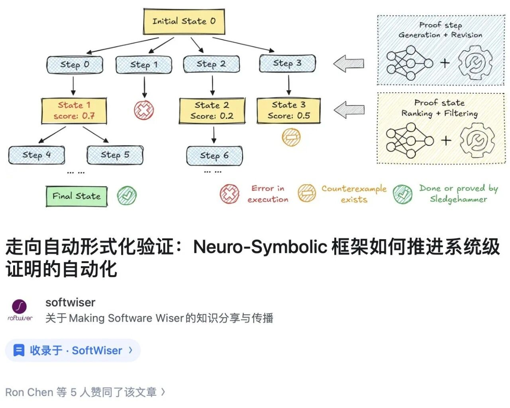
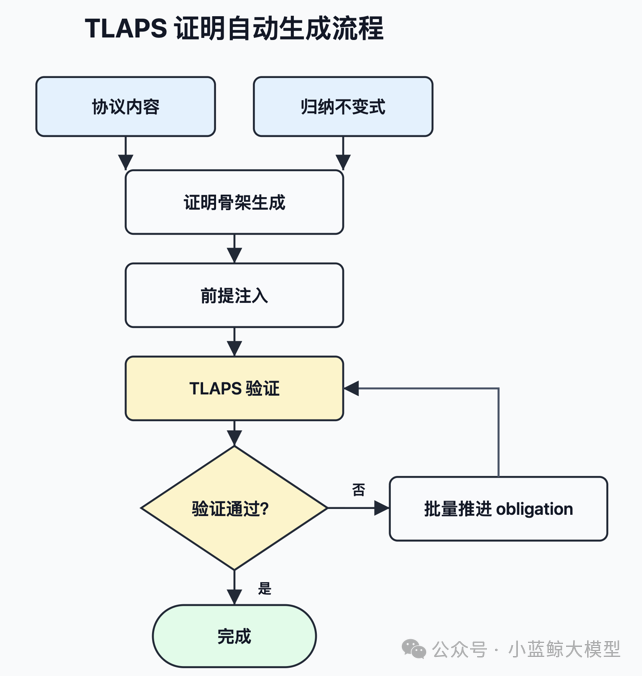

As Bjarne Stroustrup said, "software carries our civilization." Ensuring the absolute correctness of large-scale software is a foundation for reliable information systems and a long-standing goal in software engineering. Formal proof offers a mathematically rigorous path toward that goal, but its human cost remains prohibitive. Verifying the seL4 operating-system kernel, which has fewer than ten thousand lines of source code, took more than 11 person-years [1]. End-to-end verification of the real distributed systems IronRSL and IronKV took 3.7 person-years [2]. This cost makes proof automation an urgent problem.

Recent progress in large language models has brought new opportunities. The Software Institute team at Nanjing University has carried out a series of studies on automated formal proof for foundational software systems. Their neuro-symbolic proof-generation framework substantially improves automation: using only a locally fine-tuned 7B model, it nearly doubles the success rate for automatically generating proofs of seL4-related theorems, from 40.3% to 77.6%. This work has been accepted by OSDI 2026. For safety proofs of distributed protocols, the team has also built an automated pipeline from inductive invariant generation to TLAPS proof writing and final safety verification. It can use general-purpose large models to fully prove an industrial-grade distributed protocol such as MongoLoglessDynamicRaft, producing more than 6,000 lines of proof.

---

### 01 A lightweight local solution proves 77% of seL4 theorems

In automated formal verification for the industrial-grade seL4 operating-system kernel, large language models show strong potential for mathematical reasoning and proof-code generation, but they also reveal clear weaknesses. They may produce logical hallucinations or steps that violate the strict syntax and semantics of interactive theorem provers (ITPs). In long and complex proofs, relying entirely on an LLM-generated sequence of steps often causes the proof to fail midway.

To address this issue, the team proposes a neuro-symbolic proof-generation framework. The core idea is simple: instead of letting the LLM work alone, make it collaborate closely with the ITP. The LLM acts as a heuristic generator, predicting candidate next steps from the current proof state. The ITP immediately checks each step and provides support for error repair, redundancy filtering, and branch completion. This turns proof generation from a one-shot attempt into a closed loop of generation, checking, repair, and feedback.

Figure 1: A proof-generation framework based on neuro-symbolic integration

Experiments show that with only a locally fine-tuned 7B model, the framework improves the automatic proof-generation success rate on seL4 from 40.3% to 77.6%.

### 02 An end-to-end proof framework writes a 6,000-line TLAPS proof

The team has also made progress on automated safety proofs for distributed protocols. Distributed protocols run in environments with many nodes, arbitrary network delays or partitions, and possible node failures or malicious messages. A single safety bug can cause history forks, state rollback, or consensus failure. Even some protocols that have been manually proved or checked by TLC at finite scale have later been found to contain errors. Theorem proving for distributed-protocol safety is therefore essential.

This task is difficult because protocol interactions are complex, state spaces explode, and key inductive invariants often require repeated trial and error. For example, Basilisk reports that IronFleet spent months proving the inductive invariant for Multi-Paxos [3], and IronFleet's end-to-end verification of two real distributed systems required about 3.7 person-years [2].

The team implements an automated framework that generates inductive invariants, writes TLAPS proofs, and proves protocol safety properties. The technical path first combines large models with the classical IC3 algorithm through neuro-symbolic methods to obtain inductive invariants for distributed protocols. It then uses an agentic harness to generate TLAPS proof scripts automatically. Importantly, the TLAPS proof stage uses no protocol-specific manual prompts or handwritten lemmas. The agent sees only the protocol, the inductive invariant, the proof goal, and general proof feedback, and then iteratively advances proof obligations until it produces a complete proof.

Figure 2: Automatic TLAPS proof-generation workflow

For MongoLoglessDynamicRaft, a logless dynamic reconfiguration protocol proposed and deployed by MongoDB engineers William Schultz and colleagues [4], the team has completed a fully automated safety proof. The resulting proof contains 6,308 lines of TLAPS code, all generated by the agent.

### 03 The future: Verified Spec-driven Development

The continuing improvement of large language models is reshaping the boundary of formal verification. Frontier models with longer context windows and stronger reasoning ability can already call external tools autonomously when given the workflow. Numina-Lean-Agent, which combines Claude Code with the Lean theorem prover, solved all 12 problems in the Putnam 2025 competition [5]. In Agentic Proof Automation, researchers used Claude Code to generate proofs for an algorithm with 14,000 lines of Lean code and achieved an 87% success rate on 189 evaluated tasks, with about 16% requiring human intervention [6].

Formal verification is moving out of the academic ivory tower and into mainstream software development. In the future, developers may only need to clearly describe system behavior and constraints to obtain provably correct implementations, while every code change can receive mathematical correctness guarantees in real time.

References:

[1] Klein, Gerwin, et al. "seL4: Formal verification of an OS kernel." Proceedings of the ACM SIGOPS 22nd symposium on Operating systems principles. 2009.

[2] C. Hawblitzel, J. Howell, M. Kapritsos, J. R. Lorch, B. Parno, M. L. Roberts, S. Setty, and B. Zill, "IronFleet: Proving Practical Distributed Systems Correct," in Proceedings of the 25th Symposium on Operating Systems Principles (SOSP 2015), pp. 1-17, 2015.

[3] T. N. Zhang, K. Singh, T. Chajed, M. Kapritsos, and B. Parno, "Basilisk: Using Provenance Invariants to Automate Proofs of Undecidable Protocols," in 19th USENIX Symposium on Operating Systems Design and Implementation (OSDI 2025), 2025.

[4] W. Schultz and S. Zhou, "Rapid Prototyping A Safe, Logless Reconfiguration Protocol For MongoDB With TLA+," MongoDB Technical Blog.

[5] Liu, Junqi, et al. "Numina-Lean-Agent: An Open and General Agentic Reasoning System for Formal Mathematics." arXiv preprint arXiv:2601.14027 (2026).

[6] Xu, Yichen, and Martin Odersky. "Agentic Proof Automation: A Case Study." arXiv preprint arXiv:2601.03768 (2026).

<a href="https://mp.weixin.qq.com/s/ZAUnN5HRdPGvVQtlGgFrJA" target="_blank">Read original article</a>
